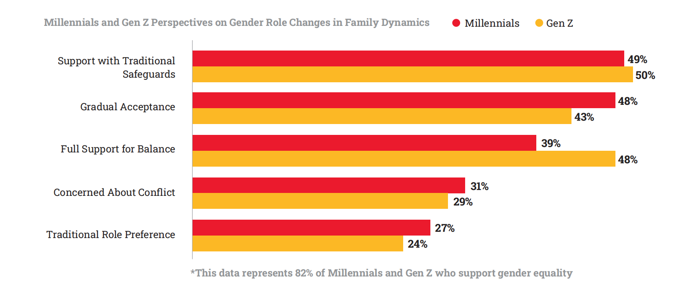

# INDONESIA MILLENIAL AND GEN Z REPORT 2025
## About the Report
As we present the Indonesia Millennial and Gen Z Report 2025, IDN brings together key insights from across the country, highlighting the evolving role of two generations that are shaping Indonesia’s future. Millennials and Gen Z are not just participants in change—they’re leading it, stepping into positions of influence and redefining what it means to be part of a rapidly shifting society.

With political shifts, technological advances, and the increasing dominance of digital life, both generations are taking on leadership roles, pushing for positive change, and advocating for sustainability. They are hopeful about Indonesia’s economic recovery and see encouraging progress in areas like work-life balance, inclusivity, and mental health support in the workplace.

Yet, challenges are still at the forefront. Issues such as the rising cost of living, job insecurity, climate change, and mental health continue to weigh on the minds of many. As AI and automation reshape industries, questions about the future of work loom larger. Despite these uncertainties, Millennials and Gen Z remain optimistic, expecting businesses to step up and address both social and environmental issues head-on.

The Indonesia Millennial and Gen Z Report 2025 reflects the determination of these generations—a collective mindset focused on overcoming obstacles and creating a more sustainable, brighter future for the country.

## Generational Insights:
A Snapshot of Indonesia’s Millennials and Gen Z

### Shifting Gender Roles
Both Millennials and Gen Z support evolving gender roles in the household, but their approaches differ. Gen Z is more proactive in embracing change, while Millennials prefer a more gradual shift, influenced by traditional family values.

### The Rise of Nomad Media
Both Millennials and Gen Z are gravitating towards nomad media—news media outlets established on social media—valuing their blend of credibility and creativity. Gen Z naturally embraces this digital-first approach, while Millennials are also adapting to this shift in media consumption.

### Urbanization and Family Dynamics
Urbanization has pushed both generations to rely on technology to stay connected with extended family. However, Millennials express more concern about the erosion of traditional family ties, whereas Gen Z is more adaptable to these new realities.

### Viral Content and Emotional Engagement
For both generations, viral content thrives on authenticity and emotional connection. Gen Z actively engages in creating and sharing viral moments, while Millennials tend to participate more passively, appreciating the cultural shift.

### Economic Adaptation through Frugality
Both generations have adopted frugal living in response to rising costs, but with different focuses. Gen Z prioritizes saving through discounts and deals, while Millennials balance cost-cutting with side jobs to ensure financial stability.

### Musical Theater’s Resurgence
Musical theater is making a comeback, appealing to both Millennials and Gen Z. Gen Z is drawn to the immersive live experience, while Millennials find comfort in the nostalgia and familiar themes these performances offer.

### Education Reform with Kurikulum Merdeka (The Emancipated Curriculum)
The Kurikulum Merdeka resonates with both generations, as it emphasizes real-world skills. Gen Z views the reform as essential for their future, while Millennials welcome it as a necessary update to the traditional education system they experienced.

### Political Engagement Amid Economic Pressures
Economic challenges are driving political engagement for both generations. They are pushing for policies that address job security and fair wages, united in their desire to find solutions to the financial pressures they face.

### Social Media and Mental Health
The mental health impact of social media is evident for both Millennials and Gen Z, with many facing anxiety and stress. Both generations are increasingly adopting digital detox practices to manage their online presence and maintain well-being.

### Social Media as a Tool for Activism
Both Millennials and Gen Z use social media as a key tool for political activism, raising awareness and driving discussions around important issues. However, both recognize the need to translate online advocacy into tangible real-world action.

# CHAPTER 01 FAMILY AND VALUES
## Breaking Boundaries from Traditional Roles to New Expectations
Modern Indonesian families are steadily moving away from traditional gender roles, embracing a more balanced approach to sharing household and professional responsibilities. With an increasing number of women entering the workforce, the long-standing notion of the father as the sole breadwinner is evolving. This shift not only marks progress toward gender equality but also empowers women to pursue careers and attain financial independence, providing them with a safeguard against domestic violence and unhealthy household dynamics. Whether as full-time working mothers or through leveraging digital platforms—such as e-commerce, affiliates, and virtual assistant roles—these women demonstrate that motherhood and professional ambitions can coexist harmoniously.

### Embracing the Role of the Modern Father
Despite these advancements, the double burden of domestic responsibilities often persists, underscoring the need for husbands to actively support and share in household duties. Modern fathers are increasingly taking on roles as “househusbands,” supporting their partners’ careers and becoming more involved in family life. This evolving concept of fatherhood is particularly embraced by Gen Z, who are more open to changes in gender roles, while Millennials often exhibit a blend of adherence to traditional values and cautious acceptance of new expectations. By challenging stereotypes and promoting equitable roles, fathers today are contributing to a more balanced and nurturing family environment. This benefits everyone: children gain diverse role models, women are relieved from the dual burden, and men discover fulfillment in nurturing roles.

### Balancing Tradition and Progress in Family Life
Our data shows that both Gen Z and Millennials maintain a deep respect for traditional values, particularly concerning evolving gender roles within the family. While 82% of both generations support gender equality, backing changes in gender roles as long as they don’t disrupt existing traditions, it’s clear that preserving cultural norms remains a significant concern for both groups. This highlights that, while there is growing acceptance of gender role evolution, there is also a strong inclination to maintain a connection to established cultural practices. This delicate balance between embracing modernity and honoring tradition underscores the thoughtful and nuanced approach both generations take toward changes in family structures.

  

#### How Millennials & Gen Z Respond to Gender Shifting Roles in Family

  

However, a clear difference emerges in the degree of acceptance and enthusiasm for these changes. Millennials, though supportive of shifts in gender roles, tend to approach them with caution—48% indicate they need time to adjust. In contrast, Gen Z demonstrates a more progressive stance, with nearly half (48%) fully endorsing the belief that shifting gender roles can bring balance and happiness to the family. This generational gap underscores Gen Z’s reputation for being forward-thinking and adaptable, showing a greater willingness to embrace significant changes in household dynamics. Gen Z’s openness likely stems from broader exposure to global ideas of gender equality and a strong belief in the positive outcomes of such changes, whereas Millennials, despite their support, may still prefer the security of gradual adaptation and the comfort of traditional values.

Kalis Mardiasih, an opinion writer and young Nahdlatul ‘Ulama (NU) activist, reflects on her experiences growing up in a rural area where discussions about gender equality were rare. She notes that it wasn’t until she had access to broader learning opportunities that she began to grasp the wider implications of gender equality. Research suggests that while many express support for gender equality, they often haven’t taken action to advocate for it, primarily because they haven’t faced situations demanding more than just verbal support. Mardiasih stresses that awareness is crucial, but it’s only the first step. She advocates for the creation of communities and safe spaces where individuals are encouraged to speak up and take meaningful action. According to her, progress in gender equality is a process, and every small step forward matters. It’s not about achieving perfection or becoming experts overnight but about making gradual progress and acknowledging the strides made along the way.

### Empowering Women in Their Careers and Beyond
Since 1990, Indonesia has made significant strides in increasing female labor force participation. However, the gender gap remains substantial, particularly when compared to other upper-middle-income countries. Despite improvements in education and a decline in early marriage rates, women’s participation in the workforce has seen only marginal growth. A key barrier that continues to hinder progress is the lack of affordable, high-quality childcare. Our survey found that 40% of women leave their jobs after marriage and childbirth, with nearly half citing family responsibilities as the primary reason.

----

Investing in childcare is not merely a social necessity but also an economic opportunity. Enabling women to remain in the workforce could significantly boost the economy. According to the World Bank, even a modest increase in women’s labor participation could add as much as $62 billion to Indonesia’s economy. As the country continues to develop its infrastructure and social systems, the rising number of working women will further drive demand for childcare services, creating additional employment opportunities in this sector.

This progress is reflected in the improvement of Indonesia’s Gender Inequality Index, which has advanced from 0.499 in 2018 to 0.447 in 2023. This index considers various factors, including reproductive health, women’s empowerment initiatives, and the ratio of women to men in the workforce. For example, reproductive health indicators such as maternal mortality rates and adolescent birth rates show continuous societal efforts to enhance gender equality. However, despite these advancements, Indonesia currently allocates just 0.04% of its GDP to early childhood care and development, far below the Organisation for Economic Co-operation and Development (OECD) recommendation of 1%. Increasing this investment could yield substantial benefits, potentially adding up to $62 billion to Indonesia’s GDP annually.

To unlock these benefits, the Indonesian government could consider several key actions:
- Establish a national policy with clear goals and responsibilities to increase the availability and quality of childcare services.
- Implement fiscal programs aimed at making childcare more affordable, particularly for low-income families.
- Invest in the childcare sector by supporting women entrepreneurs in starting and running childcare businesses.
- Launch awareness campaigns to emphasize the importance of childcare and the need for societal support for working women.

### Navigating Financial Independence Across Generations

  

As gender roles evolve, the strategies Millennials and Gen Z use to achieve financial independence are also shifting. Our data suggests that Millennials adopt a more balanced approach, placing slightly greater emphasis on both saving/investing and creating household budgets. With 39% of Millennials prioritizing budgeting compared to 34% of Gen Z, it’s clear that Millennials favor a more structured and organized method for managing their finances. This focus on budgeting underscores a generational preference for financial planning and structure, likely influenced by their current life stages and financial responsibilities.

Additionally, both generations show a strong interest in increasing income through side jobs or small businesses, with 43% of Gen Z and 44% of Millennials employing this strategy. This shared approach reflects a recognition across generations of the importance of diversifying income sources in today’s economic environment. However, the slight differences in financial priorities reveal a generational divide: Gen Z leans more toward investing and wealth accumulation as key strategies for long-term financial security, while Millennials focus more on budgeting and financial planning to achieve stability and independence.

#### Millennials and Gen Z Diverse Paths to Financial Independence
> Both Millennials and Gen Z acknowledge the importance of saving and investing as essential strategies for building financial security. Gen Z, in particular, prioritizes these actions, reflecting their focus on long-term wealth accumulation.

> Across generations, there is a strong interest in supplementing income through side hustles or entrepreneurship. This approach allows families to diversify their income streams and mitigate financial risk.

> Millennials, more so than Gen Z, emphasize the importance of budgeting. By organizing their finances through budgeting, families can better manage their expenses, plan for the future, and ensure financial stability.

### Opening Doors for Women’s Empowerment and Growth
Kalis Mardiasih highlights that daycare services are not just a modern innovation but a continuation of Indonesia’s cultural legacy. In many communities, children have traditionally been raised collectively—not just by their parents, but also by grandparents, neighbors, and extended family members. As more women enter the workforce, expanding access to daycare is essential for promoting gender equality. However, it is vital to ensure that these services are accessible to everyone, regardless of their location. By embracing and expanding daycare, Indonesia can honor its tradition of communal caregiving while empowering women to pursue their professional goals without compromising their roles as mothers.

> **“Daycare isn’t just a modern necessity; it’s deeply connected to our tradition of families and communities raising children together. As more women enter the workforce, ensuring accessible daycare becomes essential not only for gender equality but also for empowering families to make informed financial decisions. Expanding these services supports women in their careers, while families can plan their finances with greater confidence, knowing their children are well cared for”**
>
> — Kalis Mardiasih, an Opinion Writer and Young Nahdlatul ‘Ulama (NU) Activist.

Investing in childcare is, fundamentally, an investment in Indonesia’s future. It supports working women, encourages greater involvement from husbands in household responsibilities, strengthens the economy, and fosters a more inclusive society. By taking these steps, the government can unlock Indonesia’s full potential and pave the way for a brighter, more equitable future.

## Redefining Relationships with New Perspectives on Marriage and Divorce
Indonesia is undergoing a profound transformation in family dynamics, particularly in marriage, where rising divorce rates and changing attitudes towards traditional unions are reshaping the social fabric. Over the past few years, the country has experienced a significant increase in divorce rates, with data from the Central Bureau of Statistics (BPS) showing that the number of divorce cases has steadily climbed, reaching up to 500,000 annually. This alarming trend has raised concerns among various parties, including the government, with the Head of the National Population and Family Planning Agency (BKKBN) warning that the rising divorce rate could threaten the stability and resilience of families.

### Understanding Modern Challenges Behind Rising Divorce Rates

  

The rising divorce rates in Indonesia are a significant concern, with 62% of Indonesians acknowledging this trend. Millennials, especially those living in big cities, are facing increased marital instability. The pressures of modern life—such as financial stress, demanding work schedules, and the complexities of balancing personal and professional responsibilities—are contributing to the strain on marriages.

A common misconception is that women are primarily responsible for the rising divorce rates, particularly since the majority of divorce applications are filed by women. However, this view oversimplifies the complex reasons behind many divorces. In Indonesia, many cases stem from gender inequality and power dynamics that place women in subordinate positions. This often leads to situations where women endure domestic abuse, including emotional, physical, and financial mistreatment. Economic factors also play a significant role, as women frequently work to supplement the family income due to the rising cost of living, while men may not equally share household responsibilities.

The dissolution of marriages impacts not only the individuals involved but also has broader implications for children, extended families, and society as a whole. The emotional and financial toll of divorce can be profound, creating a ripple effect that affects communities and future generations.

### Strengthening Marriages with Better Support and Policies
To address the rising divorce rates and shifting attitudes toward marriage, there is an urgent need for comprehensive support systems to help couples navigate the complexities of modern life. Accessible marriage counseling, community-based support networks, and policies promoting work-life balance are crucial in strengthening marriages and preventing divorce.

Additionally, educational programs that prepare young people for the realities of marriage—focusing on communication, financial management, and conflict resolution—can equip future generations with the tools needed to build strong, resilient relationships. These initiatives should be bolstered by government policies that provide financial incentives for couples, such as tax benefits and affordable housing, to alleviate the economic pressures that often strain marriages.

Supporting women through education, financial opportunities, and legal protections is essential for reducing rising divorce rates and ensuring the well-being of all family members. Financial empowerment, in particular, plays a critical role in enabling women to leave unhealthy or abusive marriages and secure a better future for themselves and their families.

> **“We need strong support systems to help couples handle the pressures of modern life—things like accessible marriage counseling, community networks, and policies that support work-life balance. Educating young people on the realities of marriage, from communication to financial management, is key to building resilient relationships. It’s also crucial that government policies offer real financial incentives and protections, especially for women, so they have the resources and confidence to leave unhealthy or abusive marriages if needed”**
>
> — Samanta Elsener, M.Psi., Psychologist & Writer.

### A Collective Effort to Adapt to Changing Views on Marriage
The rising divorce rates and changing nature of marriage in Indonesia present challenges that require a coordinated and proactive response. Policymakers, community leaders, and individuals must work together to create an environment that supports and strengthens marriages, recognizing the critical role they play in the fabric of society.

By addressing the underlying causes of marital instability and providing the necessary support to couples, Indonesia can help ensure that marriages remain a strong foundation for both families and the nation. This collective effort is essential not only for the well-being of current generations but also for the future stability and prosperity of Indonesian society.

The time to act is now. By embracing these challenges with compassion, understanding, and a commitment to positive change, we can build a society where marriage remains a cherished and enduring institution, capable of adapting to the evolving needs and aspirations of its people.

## Parenting Today by Blending Tradition with Urban Life
As Indonesia rapidly urbanizes and undergoes societal changes, the traditional bonds that have long tied families together are being tested and transformed. The Indonesia Millennials and Gen Z Report explores the evolving dynamics of family relationships among Millennials and Gen Z, particularly how these generations balance the deep-rooted communal values of Indonesian culture with the demands of modern life.

### Redefining Family Ties for Millennials and Gen Z

  

Our data reveals that a significant majority of Millennials and Gen Z maintain close ties with their extended families, with 73% of respondents across both generations reporting a strong connection. This enduring bond underscores the cultural significance of family in Indonesian society, where relationships with extended relatives are often seen as crucial to one’s social and emotional support network. However, a closer look at the data reveals important nuances in how these bonds differ between urban and rural settings.

Millennials and Gen Z in smaller cities report feeling closer to their extended families than their counterparts in larger urban areas. For instance, 74% of Gen Z in smaller cities feel close to their families, compared to just 70% in big cities. Similarly, 76% of Millennials in smaller cities maintain close ties, slightly more than the 71% in big cities. Although the differences are modest, they suggest that the fast-paced, high-pressure lifestyle associated with urban areas might be subtly weakening familial bonds.

  

In smaller cities, the slower pace of life and close-knit communities create a more favorable environment for nurturing family relationships. The communal approach to childcare, deeply rooted in Indonesian culture, remains strong in these areas. It is common to see neighbors, extended family members, and grandparents actively participating in raising children, reflecting the belief that “it takes a village to raise a child.” This communal spirit, known locally as “gotong-royong,” emphasizes mutual support and collective responsibility, extending childcare duties beyond just the parents.

In contrast, the pressures of urban life—marked by demanding work schedules and the distractions of modern living—appear to be undermining these traditional practices. The data suggests that Millennials and Gen Z in big cities may have less time and emotional energy to invest in relationships with their extended families, potentially leading to a gradual weakening of these bonds over time.

### Keeping Cultural Traditions Alive in Modern Parenting
For Millennials and Gen Z, blending traditional values with modern life is crucial to maintaining close relationships with their extended families. Many young families still live with or near their parents, enabling grandparents to play a significant role in raising the children. This arrangement not only strengthens family bonds but also helps preserve cultural values as younger generations navigate the complexities of modern life.

This lifestyle is more than just practical; it is a deliberate choice to keep heritage alive. The survey indicates that values such as mutual care, gotong-royong, and respect remain deeply ingrained. A substantial 64% of Millennials and 63% of Gen Z place great importance on maintaining family connections, with a similar percentage valuing the spirit of gotong-royong. Politeness and respect also hold strong, with 60% of both groups emphasizing their significance.

These values continue to shape family dynamics, demonstrating that while times change, the core of Indonesian family life endures. However, this communal spirit can sometimes lead to friction, especially when personal parenting decisions differ from community expectations. Differences in areas like diet or screen time can result in misunderstandings or conflicts within the family.

Sandra Ratnasari, Editor in Chief of Popmama.com, highlights the challenges that first-time parents often face when setting boundaries with older relatives involved in childcare. She points out that while respecting elders is a deeply rooted cultural value, it is equally important for young parents to have the space to navigate their own parenting journey. They need the freedom to establish their routines, even if it involves a learning curve. According to Ratnasari, finding a balance between honoring tradition and embracing modern parenting practices is essential for maintaining family harmony and ensuring that cultural values remain relevant in today’s world.

> **“Respect for elders is essential in our culture, but young couples should have the freedom to discover their own approach to parenting, even as they learn through experience. Balancing the respect for tradition with the flexibility for modern parenting is key to maintaining family harmony”**
>
> — Sandra Ratnasari, Editor in Chief of Popmama.com.

### Guiding Children in the Digital Age

  

As urban life continues to strain traditional family ties, the role of technology in parenting has become increasingly significant. The data highlights how Millennials and Gen Z parents in Indonesia are navigating the challenges of integrating technology into their children’s lives, with a clear focus on controlling and curating their children’s digital experiences.A significant portion of parents—57% overall—choose to limit their children’s access to certain technology devices. This approach is particularly favored by Millennials, with 60% employing this strategy compared to 53% of Gen Z parents. This suggests that Millennials, who likely experienced the rise of technology during their own formative years, are more inclined to set boundaries to prevent overexposure to digital devices.

  

The data also reveals a difference between Gen Z parents in big cities and those in smaller cities. In big cities, only 49% of Gen Z parents limit access, while 57% in smaller cities do the same. This may indicate that Gen Z parents in urban areas, influenced by the pervasive use of technology in city life, are more lenient, whereas those in smaller cities may take a more conservative or traditional approach.

Choosing educational applications and websites that align with cultural values is the second most common strategy, with 27% of parents overall selecting this option. Gen Z parents are slightly more inclined toward this approach (29%) compared to Millennials (24%). This preference underscores a growing awareness among Gen Z parents of the importance of cultural relevance in their children’s digital content.

Interestingly, Gen Z parents in big cities are more likely (30%) to prioritize cultural educational content than their counterparts in smaller cities (27%). This could reflect a trend where urban Gen Z parents, exposed to diverse global cultures, are actively seeking content that reinforces Indonesian cultural identity amidst the influx of international media.

Only 9% of parents choose to completely avoid the use of technology for educational purposes. This figure is consistent across both Millennials and Gen Z, indicating that a small but steady minority of parents prefer traditional, non-digital educational methods.

Notably, there is a slight increase among Gen Z parents in big cities (12%) who avoid technology compared to those in smaller cities (8%). This may suggest a counter-trend where some urban parents, possibly concerned about the overuse of technology, are opting to keep their children’s education tech-free.

Allowing children to use technology freely is the least popular strategy, chosen by only 8% of Millennials and Gen Z parents. Millennials in big cities show a slightly higher preference at 9%, while those in smaller cities are at 8%. Among Gen Z parents, 8% in big cities allow free technology use, compared to just 5% in smaller cities. The data suggests a general consensus among parents of both generations, across different city sizes, that unrestricted access to technology is not advisable.

### Strengthening Urban Family Connections in a Changing Society
The insights from this data underscore the importance of reinforcing family support systems, particularly in urban areas where traditional bonds may be weakening. In smaller cities, where gotong-royong remains deeply ingrained, parents often find it easier to incorporate communal childcare into their daily lives. However, in bustling urban centers, maintaining this sense of community is more challenging, leading to a greater reliance on technology as a form of support—a clear departure from traditional practices.

Danesya Mayra Juzar, founder of Productive Mamas & Mindtastic, reflects on the pivotal role technology now plays in family life and how it’s reshaping parent-child dynamics. She emphasizes that in today’s world, digital literacy isn’t just an extra skill—it’s a fundamental part of parenting. According to Danesya, children need to be tech-savvy, but they also need to understand the boundaries and responsibilities that come with it. She believes it’s about teaching them to use technology not just effectively but wisely. While technology offers tremendous benefits, it’s crucial to strike the right balance to avoid weakening the strong family ties that are central to Indonesian culture.

> **“In urban settings, where life is fast-paced and screens are everywhere, it’s easy for family interactions to be overshadowed by digital distractions. Parents need to ensure that screen time doesn’t replace face-to-face time. By integrating digital tools with a mindful approach, we can help our children grow up in a world where technology enhances rather than diminishes our cultural and family values”**
>
> — Danesya Mayra Juzar, founder of Productive Mamas & Mindtastic

### Preserving Family Bonds Amid Rapid Modernization
As technology becomes an integral part of parenting, its role varies significantly depending on the environment, reflecting broader societal shifts in how traditional values are being adapted to modern realities.

While the data reaffirms the strong family connections that define Indonesian society, it also highlights the subtle yet significant ways in which urbanization is affecting these relationships. As Indonesia continues its journey toward modernization, it is crucial to address the challenges that urban living poses to family dynamics. By doing so, the cultural value of strong family ties can remain intact, evolving to meet the demands of contemporary life while preserving the social fabric that has been woven by generations of Indonesian families.

### Finding Balance in Managing Kids’ Screen Time
#### Millennial Parents
> **Maria, 35 years old, Jakarta - Marketing Manager:** 
> “I’m committed to avoiding my kid becoming addicted to devices. I’m setting strict rules on screen time and focusing on educational content. My aim is to encourage my child to engage in more outdoor play and real-world interactions, fostering an appreciation for life beyond the screen.”

> **Azman, 36 years old, Jakarta - IT Specialist:** 
> “Given my own experience with technology, I’m careful about how and when my children use screens. I’ve decided they won’t have their own devices until they’re older, focusing on child-safe content and educational apps to ensure a balanced upbringing. I sometimes fear there will be protests in the near future but let’s see who can hold the fort longer—me or my kid.”

> **Raka, 36 years old, Surabaya - Chemical Engineer:** 
> “Seeing my sister’s kids overly reliant on screens, I’ve chosen to keep devices out of social settings and family activities. We engage in activities that involve everyone and emphasize unplugging to promote my child’s well-being and personal development. While it’s tempting to seek a specific number of screen hours as a ‘safe’ guideline for technology use, there’s no solid evidence proving that fixed limits are inherently beneficial. Instead, focusing on mindful and balanced usage is key.”

> **Fifa, 36 years old, Jakarta - Elementary Teacher:** 
> “I agree with other parents and experts that phones and tablets, especially with the content they offer, can harm our kids and us. Endless YouTube playlists and algorithms erode our attention spans, making us less social and more anxious. I feel it myself every time I’m glued to my phone instead of doing something else. That’s why my friends and I decided to ban YouTube and keep tablets out of our homes. We want our kids to experience boredom and let their attention spans develop naturally, without constant screen distractions.”

#### Gen Z Parents
**Aulia, 25 years old, Bandung - Social Media Manager:** 
“As a Gen Z parent, I aim to integrate technology into my children’s lives in a balanced way, focusing on educational and creative uses while managing time limits. In today’s world, where technology is essential and platforms like YouTube are useful, it’s inevitable that kids will need their own devices. The challenge is navigating when, which ones, how much, and what to limit, which can be overwhelming. Striking the right balance is tough; I’ve often worried whether we were too strict or too lenient. Especially during the pandemic, finding a healthy screen time routine for each child has been more complex than ever.”

**Danisa, 26 years old, Jakarta - Graphic Designer:** 
“I’m cautious about my children’s online activity. I use filters and set daily limits to ensure their screen time is regulated and safe, aiming to instill an understanding of responsible technology use from an early age.”

**Marissa, 26 years old, Jakarta - Freelance Writer:** 
“I sometimes rely on screens to occupy my child. Though I feel guilty about not managing screen time more strictly, my priority is balancing work and family needs. I strive to make screen time as purposeful as possible given the circumstances.”

**Arayya, 26 years old, Bandung - Project Manager:** 
“Using screens in restaurants helps keep my kids occupied and avoid disturbing other diners. It’s not just for my convenience but also about respecting others in public spaces. Many parents feel the same pressure, as there’s a growing sense that society prefers families to stay home or stick to designated play areas, away from public spaces.

## Spirituality and Faith Guiding Indonesia’s Youth
### Drawing Strength and Guidance from Faith
Religion continues to be a cornerstone for both Millennials and Gen Z in Indonesia, offering a source of gratitude and a foundation for moral guidance. Across urban and rural settings alike, faith plays a deep-rooted role in helping people navigate the complexities of modern life. Millennials, particularly those in smaller towns, maintain a strong connection to their religious values, often turning to their faith for ethical direction and finding comfort during difficult times. This connection to traditional values remains particularly strong in community-oriented environments, where faith continues to influence daily decisions and actions.

For Gen Z, religion plays an equally significant role, often serving as a stabilizing force amid the unpredictability of the modern world. In smaller, close-knit communities, this generation is deeply engaged in religious practices, finding comfort and stability in their faith. Even in the fast-paced environments of urban areas, many Millennials and Gen Z individuals seek solace and a connection to a higher power through their spirituality, underscoring the enduring importance of faith in providing purpose and grounding in the face of life’s challenges. This spiritual connection, often more profound in smaller towns, highlights how communal and traditional aspects of these environments foster a deeper, more personal relationship with faith.

-- pic

### How Young People Connect with Religious Communities
The data reveals a distinct generational divide in how Millennials and Gen Z use social media for religious purposes. Nearly half of Gen Z (49%) turn to these platforms primarily for learning about religion, reflecting a phase of exploration where understanding and education take precedence. In contrast, Millennials are more active when it comes to sharing and discussing their beliefs. With 26% of Millennials participating in religious discussions and the same percentage sharing their religious experiences online, this group demonstrates a stronger inclination towards community engagement and active participation in spiritual matters.

-- pic

Social media is proving to be much more than a passive space for religious content; it’s actively shaping how people engage with their faith and connect with others. For Millennials, particularly those in urban environments, social media serves as a crucial platform for following religious leaders, engaging in discussions, and sharing beliefs. This higher level of participation underscores the role of social media in fostering a sense of community around religion. Meanwhile, Gen Z, especially in cities, seems to use social media more for personal growth and understanding, prioritizing learning before they engage more deeply with others.The broader picture shows that social media’s influence on religion and spirituality is multifaceted. A significant54% of users report feeling more tolerant of religious differences thanks to their online experiences, while 46% use these platforms to deepen their understanding of religion. Additionally, 36% seek to better understand other religions, and 30% follow religious leaders and organizations, indicating that social media is fostering both personal and communal religious engagement. With 26% of users inspired to learn more about other religions and 25% participating in religious dialogues, it’s clear that social media is playing a pivotal role in enhancing religious literacy and interfaith understanding. Far from being just another digital distraction, social media is reshaping how people interact with their faith, promoting both individual reflection and collective participation.

### Encouraging Open Conversations on Tolerance and Faith
In Indonesia, a country where various religions like Islam, Christianity, Hinduism, and Buddhism coexist, the rise of religious tolerance among the younger generation is both important and timely. Lately, there’s been a clear shift – more open discussions around religion, signaling a move toward greater acceptance and mutual respect in society.

A notable example of this shift is the YouTube program “Log In,” hosted by Husein Ja’far Al Hadar, popularly known as Habib Ja’far, and Onadio Leonardo on Deddy Corbuzier’s “Close The Door” channel during Ramadan. “Log In” has garnered immense popularity, with millions of views per episode, by promoting religious tolerance through engaging and accessible content. The show features open dialogues between religious leaders from various backgrounds and everyday people navigating interfaith relationships in their families, friendships, and workplaces. These candid, often humorous conversations deliver powerful messages of peace and acceptance, deeply resonating with its audience.

> Husein Ja’far Al Hadar, Islamic Content Creator, encapsulates the essence of religious coexistence, saying, “In Islam, we are always reminded that religion should primarily be a way of life that regulates our relationships not only with God but also with other human beings, even if we believe in different things. What we should discuss is how we can all live differently while embracing kindness as a shared value for all.” This growing emphasis on tolerance extends beyond peaceful coexistence; it encourages active engagement with different beliefs and finding common ground. Programs like “Log In” are instrumental in making religious discussions relatable and relevant to Millennials and Gen Z, fostering a more inclusive and tolerant society.

> During his recent visit to Indonesia in September 2024, His Holiness Pope Francis emphasized the importance of 
religious harmony and the practice of tolerance within Indonesian society.
>> ”Harmony within diversity is achieved when every ethnic group and religious denomination acts in a spirit of brotherhood, while pursuing noble goals by serving the common good.”

>> ”Most of humanity is marginalized, lacking the means to live a dignified life and without protection from the growing and serious social inequality.”

>> ”The phenomenon of dehumanization that manipulates religion to perpetuate violence and bloody conflict, as well as the rampant exploitation of the environment that has led to a climate crisis, must be fought together by religious communities around the world.”

>> ”Prejudices can be eradicated, and an atmosphere of mutual respect and trust can grow. This is crucial to face our common challenges, including the fight against extremism and intolerance.”
## Embracing Change While Celebrating Heritage