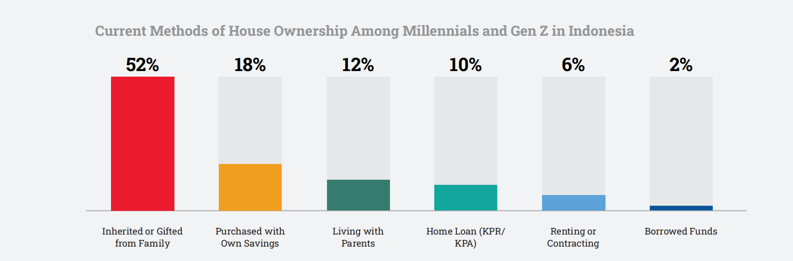
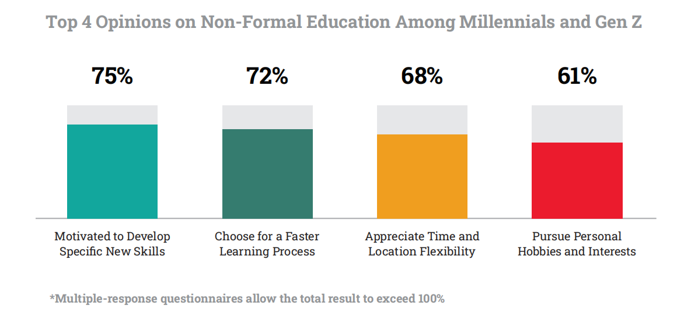
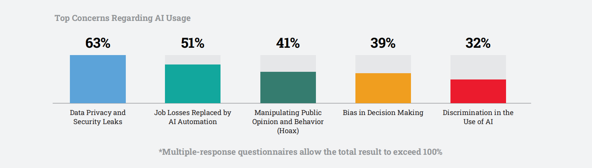

# INDONESIA MILLENIAL AND GEN Z REPORT 2025
## About the Report
As we present the Indonesia Millennial and Gen Z Report 2025, IDN brings together key insights from across the country, highlighting the evolving role of two generations that are shaping Indonesia’s future. Millennials and Gen Z are not just participants in change—they’re leading it, stepping into positions of influence and redefining what it means to be part of a rapidly shifting society.

With political shifts, technological advances, and the increasing dominance of digital life, both generations are taking on leadership roles, pushing for positive change, and advocating for sustainability. They are hopeful about Indonesia’s economic recovery and see encouraging progress in areas like work-life balance, inclusivity, and mental health support in the workplace.

Yet, challenges are still at the forefront. Issues such as the rising cost of living, job insecurity, climate change, and mental health continue to weigh on the minds of many. As AI and automation reshape industries, questions about the future of work loom larger. Despite these uncertainties, Millennials and Gen Z remain optimistic, expecting businesses to step up and address both social and environmental issues head-on.

The Indonesia Millennial and Gen Z Report 2025 reflects the determination of these generations—a collective mindset focused on overcoming obstacles and creating a more sustainable, brighter future for the country.

## Generational Insights:
A Snapshot of Indonesia’s Millennials and Gen Z

### Shifting Gender Roles
Both Millennials and Gen Z support evolving gender roles in the household, but their approaches differ. Gen Z is more proactive in embracing change, while Millennials prefer a more gradual shift, influenced by traditional family values.

### The Rise of Nomad Media
Both Millennials and Gen Z are gravitating towards nomad media—news media outlets established on social media—valuing their blend of credibility and creativity. Gen Z naturally embraces this digital-first approach, while Millennials are also adapting to this shift in media consumption.

### Urbanization and Family Dynamics
Urbanization has pushed both generations to rely on technology to stay connected with extended family. However, Millennials express more concern about the erosion of traditional family ties, whereas Gen Z is more adaptable to these new realities.

### Viral Content and Emotional Engagement
For both generations, viral content thrives on authenticity and emotional connection. Gen Z actively engages in creating and sharing viral moments, while Millennials tend to participate more passively, appreciating the cultural shift.

### Economic Adaptation through Frugality
Both generations have adopted frugal living in response to rising costs, but with different focuses. Gen Z prioritizes saving through discounts and deals, while Millennials balance cost-cutting with side jobs to ensure financial stability.

### Musical Theater’s Resurgence
Musical theater is making a comeback, appealing to both Millennials and Gen Z. Gen Z is drawn to the immersive live experience, while Millennials find comfort in the nostalgia and familiar themes these performances offer.

### Education Reform with Kurikulum Merdeka (The Emancipated Curriculum)
The Kurikulum Merdeka resonates with both generations, as it emphasizes real-world skills. Gen Z views the reform as essential for their future, while Millennials welcome it as a necessary update to the traditional education system they experienced.

### Political Engagement Amid Economic Pressures
Economic challenges are driving political engagement for both generations. They are pushing for policies that address job security and fair wages, united in their desire to find solutions to the financial pressures they face.

### Social Media and Mental Health
The mental health impact of social media is evident for both Millennials and Gen Z, with many facing anxiety and stress. Both generations are increasingly adopting digital detox practices to manage their online presence and maintain well-being.

### Social Media as a Tool for Activism
Both Millennials and Gen Z use social media as a key tool for political activism, raising awareness and driving discussions around important issues. However, both recognize the need to translate online advocacy into tangible real-world action.

# CHAPTER 01 FAMILY AND VALUES
## Breaking Boundaries from Traditional Roles to New Expectations
Modern Indonesian families are steadily moving away from traditional gender roles, embracing a more balanced approach to sharing household and professional responsibilities. With an increasing number of women entering the workforce, the long-standing notion of the father as the sole breadwinner is evolving. This shift not only marks progress toward gender equality but also empowers women to pursue careers and attain financial independence, providing them with a safeguard against domestic violence and unhealthy household dynamics. Whether as full-time working mothers or through leveraging digital platforms—such as e-commerce, affiliates, and virtual assistant roles—these women demonstrate that motherhood and professional ambitions can coexist harmoniously.

### Embracing the Role of the Modern Father
Despite these advancements, the double burden of domestic responsibilities often persists, underscoring the need for husbands to actively support and share in household duties. Modern fathers are increasingly taking on roles as “househusbands,” supporting their partners’ careers and becoming more involved in family life. This evolving concept of fatherhood is particularly embraced by Gen Z, who are more open to changes in gender roles, while Millennials often exhibit a blend of adherence to traditional values and cautious acceptance of new expectations. By challenging stereotypes and promoting equitable roles, fathers today are contributing to a more balanced and nurturing family environment. This benefits everyone: children gain diverse role models, women are relieved from the dual burden, and men discover fulfillment in nurturing roles.

### Balancing Tradition and Progress in Family Life
Our data shows that both Gen Z and Millennials maintain a deep respect for traditional values, particularly concerning evolving gender roles within the family. While 82% of both generations support gender equality, backing changes in gender roles as long as they don’t disrupt existing traditions, it’s clear that preserving cultural norms remains a significant concern for both groups. This highlights that, while there is growing acceptance of gender role evolution, there is also a strong inclination to maintain a connection to established cultural practices. This delicate balance between embracing modernity and honoring tradition underscores the thoughtful and nuanced approach both generations take toward changes in family structures.

  

#### How Millennials & Gen Z Respond to Gender Shifting Roles in Family

  

However, a clear difference emerges in the degree of acceptance and enthusiasm for these changes. Millennials, though supportive of shifts in gender roles, tend to approach them with caution—48% indicate they need time to adjust. In contrast, Gen Z demonstrates a more progressive stance, with nearly half (48%) fully endorsing the belief that shifting gender roles can bring balance and happiness to the family. This generational gap underscores Gen Z’s reputation for being forward-thinking and adaptable, showing a greater willingness to embrace significant changes in household dynamics. Gen Z’s openness likely stems from broader exposure to global ideas of gender equality and a strong belief in the positive outcomes of such changes, whereas Millennials, despite their support, may still prefer the security of gradual adaptation and the comfort of traditional values.

Kalis Mardiasih, an opinion writer and young Nahdlatul ‘Ulama (NU) activist, reflects on her experiences growing up in a rural area where discussions about gender equality were rare. She notes that it wasn’t until she had access to broader learning opportunities that she began to grasp the wider implications of gender equality. Research suggests that while many express support for gender equality, they often haven’t taken action to advocate for it, primarily because they haven’t faced situations demanding more than just verbal support. Mardiasih stresses that awareness is crucial, but it’s only the first step. She advocates for the creation of communities and safe spaces where individuals are encouraged to speak up and take meaningful action. According to her, progress in gender equality is a process, and every small step forward matters. It’s not about achieving perfection or becoming experts overnight but about making gradual progress and acknowledging the strides made along the way.

### Empowering Women in Their Careers and Beyond
Since 1990, Indonesia has made significant strides in increasing female labor force participation. However, the gender gap remains substantial, particularly when compared to other upper-middle-income countries. Despite improvements in education and a decline in early marriage rates, women’s participation in the workforce has seen only marginal growth. A key barrier that continues to hinder progress is the lack of affordable, high-quality childcare. Our survey found that 40% of women leave their jobs after marriage and childbirth, with nearly half citing family responsibilities as the primary reason.

----

Investing in childcare is not merely a social necessity but also an economic opportunity. Enabling women to remain in the workforce could significantly boost the economy. According to the World Bank, even a modest increase in women’s labor participation could add as much as $62 billion to Indonesia’s economy. As the country continues to develop its infrastructure and social systems, the rising number of working women will further drive demand for childcare services, creating additional employment opportunities in this sector.

This progress is reflected in the improvement of Indonesia’s Gender Inequality Index, which has advanced from 0.499 in 2018 to 0.447 in 2023. This index considers various factors, including reproductive health, women’s empowerment initiatives, and the ratio of women to men in the workforce. For example, reproductive health indicators such as maternal mortality rates and adolescent birth rates show continuous societal efforts to enhance gender equality. However, despite these advancements, Indonesia currently allocates just 0.04% of its GDP to early childhood care and development, far below the Organisation for Economic Co-operation and Development (OECD) recommendation of 1%. Increasing this investment could yield substantial benefits, potentially adding up to $62 billion to Indonesia’s GDP annually.

To unlock these benefits, the Indonesian government could consider several key actions:
- Establish a national policy with clear goals and responsibilities to increase the availability and quality of childcare services.
- Implement fiscal programs aimed at making childcare more affordable, particularly for low-income families.
- Invest in the childcare sector by supporting women entrepreneurs in starting and running childcare businesses.
- Launch awareness campaigns to emphasize the importance of childcare and the need for societal support for working women.

### Navigating Financial Independence Across Generations

  

As gender roles evolve, the strategies Millennials and Gen Z use to achieve financial independence are also shifting. Our data suggests that Millennials adopt a more balanced approach, placing slightly greater emphasis on both saving/investing and creating household budgets. With 39% of Millennials prioritizing budgeting compared to 34% of Gen Z, it’s clear that Millennials favor a more structured and organized method for managing their finances. This focus on budgeting underscores a generational preference for financial planning and structure, likely influenced by their current life stages and financial responsibilities.

Additionally, both generations show a strong interest in increasing income through side jobs or small businesses, with 43% of Gen Z and 44% of Millennials employing this strategy. This shared approach reflects a recognition across generations of the importance of diversifying income sources in today’s economic environment. However, the slight differences in financial priorities reveal a generational divide: Gen Z leans more toward investing and wealth accumulation as key strategies for long-term financial security, while Millennials focus more on budgeting and financial planning to achieve stability and independence.

#### Millennials and Gen Z Diverse Paths to Financial Independence
> Both Millennials and Gen Z acknowledge the importance of saving and investing as essential strategies for building financial security. Gen Z, in particular, prioritizes these actions, reflecting their focus on long-term wealth accumulation.

> Across generations, there is a strong interest in supplementing income through side hustles or entrepreneurship. This approach allows families to diversify their income streams and mitigate financial risk.

> Millennials, more so than Gen Z, emphasize the importance of budgeting. By organizing their finances through budgeting, families can better manage their expenses, plan for the future, and ensure financial stability.

### Opening Doors for Women’s Empowerment and Growth
Kalis Mardiasih highlights that daycare services are not just a modern innovation but a continuation of Indonesia’s cultural legacy. In many communities, children have traditionally been raised collectively—not just by their parents, but also by grandparents, neighbors, and extended family members. As more women enter the workforce, expanding access to daycare is essential for promoting gender equality. However, it is vital to ensure that these services are accessible to everyone, regardless of their location. By embracing and expanding daycare, Indonesia can honor its tradition of communal caregiving while empowering women to pursue their professional goals without compromising their roles as mothers.

> **“Daycare isn’t just a modern necessity; it’s deeply connected to our tradition of families and communities raising children together. As more women enter the workforce, ensuring accessible daycare becomes essential not only for gender equality but also for empowering families to make informed financial decisions. Expanding these services supports women in their careers, while families can plan their finances with greater confidence, knowing their children are well cared for”**
>
> — Kalis Mardiasih, an Opinion Writer and Young Nahdlatul ‘Ulama (NU) Activist.

Investing in childcare is, fundamentally, an investment in Indonesia’s future. It supports working women, encourages greater involvement from husbands in household responsibilities, strengthens the economy, and fosters a more inclusive society. By taking these steps, the government can unlock Indonesia’s full potential and pave the way for a brighter, more equitable future.

## Redefining Relationships with New Perspectives on Marriage and Divorce
Indonesia is undergoing a profound transformation in family dynamics, particularly in marriage, where rising divorce rates and changing attitudes towards traditional unions are reshaping the social fabric. Over the past few years, the country has experienced a significant increase in divorce rates, with data from the Central Bureau of Statistics (BPS) showing that the number of divorce cases has steadily climbed, reaching up to 500,000 annually. This alarming trend has raised concerns among various parties, including the government, with the Head of the National Population and Family Planning Agency (BKKBN) warning that the rising divorce rate could threaten the stability and resilience of families.

### Understanding Modern Challenges Behind Rising Divorce Rates

  

The rising divorce rates in Indonesia are a significant concern, with 62% of Indonesians acknowledging this trend. Millennials, especially those living in big cities, are facing increased marital instability. The pressures of modern life—such as financial stress, demanding work schedules, and the complexities of balancing personal and professional responsibilities—are contributing to the strain on marriages.

A common misconception is that women are primarily responsible for the rising divorce rates, particularly since the majority of divorce applications are filed by women. However, this view oversimplifies the complex reasons behind many divorces. In Indonesia, many cases stem from gender inequality and power dynamics that place women in subordinate positions. This often leads to situations where women endure domestic abuse, including emotional, physical, and financial mistreatment. Economic factors also play a significant role, as women frequently work to supplement the family income due to the rising cost of living, while men may not equally share household responsibilities.

The dissolution of marriages impacts not only the individuals involved but also has broader implications for children, extended families, and society as a whole. The emotional and financial toll of divorce can be profound, creating a ripple effect that affects communities and future generations.

### Strengthening Marriages with Better Support and Policies
To address the rising divorce rates and shifting attitudes toward marriage, there is an urgent need for comprehensive support systems to help couples navigate the complexities of modern life. Accessible marriage counseling, community-based support networks, and policies promoting work-life balance are crucial in strengthening marriages and preventing divorce.

Additionally, educational programs that prepare young people for the realities of marriage—focusing on communication, financial management, and conflict resolution—can equip future generations with the tools needed to build strong, resilient relationships. These initiatives should be bolstered by government policies that provide financial incentives for couples, such as tax benefits and affordable housing, to alleviate the economic pressures that often strain marriages.

Supporting women through education, financial opportunities, and legal protections is essential for reducing rising divorce rates and ensuring the well-being of all family members. Financial empowerment, in particular, plays a critical role in enabling women to leave unhealthy or abusive marriages and secure a better future for themselves and their families.

> **“We need strong support systems to help couples handle the pressures of modern life—things like accessible marriage counseling, community networks, and policies that support work-life balance. Educating young people on the realities of marriage, from communication to financial management, is key to building resilient relationships. It’s also crucial that government policies offer real financial incentives and protections, especially for women, so they have the resources and confidence to leave unhealthy or abusive marriages if needed”**
>
> — Samanta Elsener, M.Psi., Psychologist & Writer.

### A Collective Effort to Adapt to Changing Views on Marriage
The rising divorce rates and changing nature of marriage in Indonesia present challenges that require a coordinated and proactive response. Policymakers, community leaders, and individuals must work together to create an environment that supports and strengthens marriages, recognizing the critical role they play in the fabric of society.

By addressing the underlying causes of marital instability and providing the necessary support to couples, Indonesia can help ensure that marriages remain a strong foundation for both families and the nation. This collective effort is essential not only for the well-being of current generations but also for the future stability and prosperity of Indonesian society.

The time to act is now. By embracing these challenges with compassion, understanding, and a commitment to positive change, we can build a society where marriage remains a cherished and enduring institution, capable of adapting to the evolving needs and aspirations of its people.

## Parenting Today by Blending Tradition with Urban Life
As Indonesia rapidly urbanizes and undergoes societal changes, the traditional bonds that have long tied families together are being tested and transformed. The Indonesia Millennials and Gen Z Report explores the evolving dynamics of family relationships among Millennials and Gen Z, particularly how these generations balance the deep-rooted communal values of Indonesian culture with the demands of modern life.

### Redefining Family Ties for Millennials and Gen Z

  

Our data reveals that a significant majority of Millennials and Gen Z maintain close ties with their extended families, with 73% of respondents across both generations reporting a strong connection. This enduring bond underscores the cultural significance of family in Indonesian society, where relationships with extended relatives are often seen as crucial to one’s social and emotional support network. However, a closer look at the data reveals important nuances in how these bonds differ between urban and rural settings.

Millennials and Gen Z in smaller cities report feeling closer to their extended families than their counterparts in larger urban areas. For instance, 74% of Gen Z in smaller cities feel close to their families, compared to just 70% in big cities. Similarly, 76% of Millennials in smaller cities maintain close ties, slightly more than the 71% in big cities. Although the differences are modest, they suggest that the fast-paced, high-pressure lifestyle associated with urban areas might be subtly weakening familial bonds.

  

In smaller cities, the slower pace of life and close-knit communities create a more favorable environment for nurturing family relationships. The communal approach to childcare, deeply rooted in Indonesian culture, remains strong in these areas. It is common to see neighbors, extended family members, and grandparents actively participating in raising children, reflecting the belief that “it takes a village to raise a child.” This communal spirit, known locally as “gotong-royong,” emphasizes mutual support and collective responsibility, extending childcare duties beyond just the parents.

In contrast, the pressures of urban life—marked by demanding work schedules and the distractions of modern living—appear to be undermining these traditional practices. The data suggests that Millennials and Gen Z in big cities may have less time and emotional energy to invest in relationships with their extended families, potentially leading to a gradual weakening of these bonds over time.

### Keeping Cultural Traditions Alive in Modern Parenting
For Millennials and Gen Z, blending traditional values with modern life is crucial to maintaining close relationships with their extended families. Many young families still live with or near their parents, enabling grandparents to play a significant role in raising the children. This arrangement not only strengthens family bonds but also helps preserve cultural values as younger generations navigate the complexities of modern life.

This lifestyle is more than just practical; it is a deliberate choice to keep heritage alive. The survey indicates that values such as mutual care, gotong-royong, and respect remain deeply ingrained. A substantial 64% of Millennials and 63% of Gen Z place great importance on maintaining family connections, with a similar percentage valuing the spirit of gotong-royong. Politeness and respect also hold strong, with 60% of both groups emphasizing their significance.

These values continue to shape family dynamics, demonstrating that while times change, the core of Indonesian family life endures. However, this communal spirit can sometimes lead to friction, especially when personal parenting decisions differ from community expectations. Differences in areas like diet or screen time can result in misunderstandings or conflicts within the family.

Sandra Ratnasari, Editor in Chief of Popmama.com, highlights the challenges that first-time parents often face when setting boundaries with older relatives involved in childcare. She points out that while respecting elders is a deeply rooted cultural value, it is equally important for young parents to have the space to navigate their own parenting journey. They need the freedom to establish their routines, even if it involves a learning curve. According to Ratnasari, finding a balance between honoring tradition and embracing modern parenting practices is essential for maintaining family harmony and ensuring that cultural values remain relevant in today’s world.

> **“Respect for elders is essential in our culture, but young couples should have the freedom to discover their own approach to parenting, even as they learn through experience. Balancing the respect for tradition with the flexibility for modern parenting is key to maintaining family harmony”**
>
> — Sandra Ratnasari, Editor in Chief of Popmama.com.

### Guiding Children in the Digital Age

  

As urban life continues to strain traditional family ties, the role of technology in parenting has become increasingly significant. The data highlights how Millennials and Gen Z parents in Indonesia are navigating the challenges of integrating technology into their children’s lives, with a clear focus on controlling and curating their children’s digital experiences.A significant portion of parents—57% overall—choose to limit their children’s access to certain technology devices. This approach is particularly favored by Millennials, with 60% employing this strategy compared to 53% of Gen Z parents. This suggests that Millennials, who likely experienced the rise of technology during their own formative years, are more inclined to set boundaries to prevent overexposure to digital devices.

  

The data also reveals a difference between Gen Z parents in big cities and those in smaller cities. In big cities, only 49% of Gen Z parents limit access, while 57% in smaller cities do the same. This may indicate that Gen Z parents in urban areas, influenced by the pervasive use of technology in city life, are more lenient, whereas those in smaller cities may take a more conservative or traditional approach.

Choosing educational applications and websites that align with cultural values is the second most common strategy, with 27% of parents overall selecting this option. Gen Z parents are slightly more inclined toward this approach (29%) compared to Millennials (24%). This preference underscores a growing awareness among Gen Z parents of the importance of cultural relevance in their children’s digital content.

Interestingly, Gen Z parents in big cities are more likely (30%) to prioritize cultural educational content than their counterparts in smaller cities (27%). This could reflect a trend where urban Gen Z parents, exposed to diverse global cultures, are actively seeking content that reinforces Indonesian cultural identity amidst the influx of international media.

Only 9% of parents choose to completely avoid the use of technology for educational purposes. This figure is consistent across both Millennials and Gen Z, indicating that a small but steady minority of parents prefer traditional, non-digital educational methods.

Notably, there is a slight increase among Gen Z parents in big cities (12%) who avoid technology compared to those in smaller cities (8%). This may suggest a counter-trend where some urban parents, possibly concerned about the overuse of technology, are opting to keep their children’s education tech-free.

Allowing children to use technology freely is the least popular strategy, chosen by only 8% of Millennials and Gen Z parents. Millennials in big cities show a slightly higher preference at 9%, while those in smaller cities are at 8%. Among Gen Z parents, 8% in big cities allow free technology use, compared to just 5% in smaller cities. The data suggests a general consensus among parents of both generations, across different city sizes, that unrestricted access to technology is not advisable.

### Strengthening Urban Family Connections in a Changing Society
The insights from this data underscore the importance of reinforcing family support systems, particularly in urban areas where traditional bonds may be weakening. In smaller cities, where gotong-royong remains deeply ingrained, parents often find it easier to incorporate communal childcare into their daily lives. However, in bustling urban centers, maintaining this sense of community is more challenging, leading to a greater reliance on technology as a form of support—a clear departure from traditional practices.

Danesya Mayra Juzar, founder of Productive Mamas & Mindtastic, reflects on the pivotal role technology now plays in family life and how it’s reshaping parent-child dynamics. She emphasizes that in today’s world, digital literacy isn’t just an extra skill—it’s a fundamental part of parenting. According to Danesya, children need to be tech-savvy, but they also need to understand the boundaries and responsibilities that come with it. She believes it’s about teaching them to use technology not just effectively but wisely. While technology offers tremendous benefits, it’s crucial to strike the right balance to avoid weakening the strong family ties that are central to Indonesian culture.

> **“In urban settings, where life is fast-paced and screens are everywhere, it’s easy for family interactions to be overshadowed by digital distractions. Parents need to ensure that screen time doesn’t replace face-to-face time. By integrating digital tools with a mindful approach, we can help our children grow up in a world where technology enhances rather than diminishes our cultural and family values”**
>
> — Danesya Mayra Juzar, founder of Productive Mamas & Mindtastic

### Preserving Family Bonds Amid Rapid Modernization
As technology becomes an integral part of parenting, its role varies significantly depending on the environment, reflecting broader societal shifts in how traditional values are being adapted to modern realities.

While the data reaffirms the strong family connections that define Indonesian society, it also highlights the subtle yet significant ways in which urbanization is affecting these relationships. As Indonesia continues its journey toward modernization, it is crucial to address the challenges that urban living poses to family dynamics. By doing so, the cultural value of strong family ties can remain intact, evolving to meet the demands of contemporary life while preserving the social fabric that has been woven by generations of Indonesian families.

### Finding Balance in Managing Kids’ Screen Time
#### Millennial Parents
> **Maria, 35 years old, Jakarta - Marketing Manager:** 
> “I’m committed to avoiding my kid becoming addicted to devices. I’m setting strict rules on screen time and focusing on educational content. My aim is to encourage my child to engage in more outdoor play and real-world interactions, fostering an appreciation for life beyond the screen.”

> **Azman, 36 years old, Jakarta - IT Specialist:** 
> “Given my own experience with technology, I’m careful about how and when my children use screens. I’ve decided they won’t have their own devices until they’re older, focusing on child-safe content and educational apps to ensure a balanced upbringing. I sometimes fear there will be protests in the near future but let’s see who can hold the fort longer—me or my kid.”

> **Raka, 36 years old, Surabaya - Chemical Engineer:** 
> “Seeing my sister’s kids overly reliant on screens, I’ve chosen to keep devices out of social settings and family activities. We engage in activities that involve everyone and emphasize unplugging to promote my child’s well-being and personal development. While it’s tempting to seek a specific number of screen hours as a ‘safe’ guideline for technology use, there’s no solid evidence proving that fixed limits are inherently beneficial. Instead, focusing on mindful and balanced usage is key.”

> **Fifa, 36 years old, Jakarta - Elementary Teacher:** 
> “I agree with other parents and experts that phones and tablets, especially with the content they offer, can harm our kids and us. Endless YouTube playlists and algorithms erode our attention spans, making us less social and more anxious. I feel it myself every time I’m glued to my phone instead of doing something else. That’s why my friends and I decided to ban YouTube and keep tablets out of our homes. We want our kids to experience boredom and let their attention spans develop naturally, without constant screen distractions.”

#### Gen Z Parents
**Aulia, 25 years old, Bandung - Social Media Manager:** 
“As a Gen Z parent, I aim to integrate technology into my children’s lives in a balanced way, focusing on educational and creative uses while managing time limits. In today’s world, where technology is essential and platforms like YouTube are useful, it’s inevitable that kids will need their own devices. The challenge is navigating when, which ones, how much, and what to limit, which can be overwhelming. Striking the right balance is tough; I’ve often worried whether we were too strict or too lenient. Especially during the pandemic, finding a healthy screen time routine for each child has been more complex than ever.”

**Danisa, 26 years old, Jakarta - Graphic Designer:** 
“I’m cautious about my children’s online activity. I use filters and set daily limits to ensure their screen time is regulated and safe, aiming to instill an understanding of responsible technology use from an early age.”

**Marissa, 26 years old, Jakarta - Freelance Writer:** 
“I sometimes rely on screens to occupy my child. Though I feel guilty about not managing screen time more strictly, my priority is balancing work and family needs. I strive to make screen time as purposeful as possible given the circumstances.”

**Arayya, 26 years old, Bandung - Project Manager:** 
“Using screens in restaurants helps keep my kids occupied and avoid disturbing other diners. It’s not just for my convenience but also about respecting others in public spaces. Many parents feel the same pressure, as there’s a growing sense that society prefers families to stay home or stick to designated play areas, away from public spaces.

## Spirituality and Faith Guiding Indonesia’s Youth
### Drawing Strength and Guidance from Faith
Religion continues to be a cornerstone for both Millennials and Gen Z in Indonesia, offering a source of gratitude and a foundation for moral guidance. Across urban and rural settings alike, faith plays a deep-rooted role in helping people navigate the complexities of modern life. Millennials, particularly those in smaller towns, maintain a strong connection to their religious values, often turning to their faith for ethical direction and finding comfort during difficult times. This connection to traditional values remains particularly strong in community-oriented environments, where faith continues to influence daily decisions and actions.

For Gen Z, religion plays an equally significant role, often serving as a stabilizing force amid the unpredictability of the modern world. In smaller, close-knit communities, this generation is deeply engaged in religious practices, finding comfort and stability in their faith. Even in the fast-paced environments of urban areas, many Millennials and Gen Z individuals seek solace and a connection to a higher power through their spirituality, underscoring the enduring importance of faith in providing purpose and grounding in the face of life’s challenges. This spiritual connection, often more profound in smaller towns, highlights how communal and traditional aspects of these environments foster a deeper, more personal relationship with faith.

  

### How Young People Connect with Religious Communities
The data reveals a distinct generational divide in how Millennials and Gen Z use social media for religious purposes. Nearly half of Gen Z (49%) turn to these platforms primarily for learning about religion, reflecting a phase of exploration where understanding and education take precedence. In contrast, Millennials are more active when it comes to sharing and discussing their beliefs. With 26% of Millennials participating in religious discussions and the same percentage sharing their religious experiences online, this group demonstrates a stronger inclination towards community engagement and active participation in spiritual matters.

  

Social media is proving to be much more than a passive space for religious content; it’s actively shaping how people engage with their faith and connect with others. For Millennials, particularly those in urban environments, social media serves as a crucial platform for following religious leaders, engaging in discussions, and sharing beliefs. This higher level of participation underscores the role of social media in fostering a sense of community around religion. Meanwhile, Gen Z, especially in cities, seems to use social media more for personal growth and understanding, prioritizing learning before they engage more deeply with others.The broader picture shows that social media’s influence on religion and spirituality is multifaceted. A significant54% of users report feeling more tolerant of religious differences thanks to their online experiences, while 46% use these platforms to deepen their understanding of religion. Additionally, 36% seek to better understand other religions, and 30% follow religious leaders and organizations, indicating that social media is fostering both personal and communal religious engagement. With 26% of users inspired to learn more about other religions and 25% participating in religious dialogues, it’s clear that social media is playing a pivotal role in enhancing religious literacy and interfaith understanding. Far from being just another digital distraction, social media is reshaping how people interact with their faith, promoting both individual reflection and collective participation.

### Encouraging Open Conversations on Tolerance and Faith
In Indonesia, a country where various religions like Islam, Christianity, Hinduism, and Buddhism coexist, the rise of religious tolerance among the younger generation is both important and timely. Lately, there’s been a clear shift – more open discussions around religion, signaling a move toward greater acceptance and mutual respect in society.

A notable example of this shift is the YouTube program “Log In,” hosted by Husein Ja’far Al Hadar, popularly known as Habib Ja’far, and Onadio Leonardo on Deddy Corbuzier’s “Close The Door” channel during Ramadan. “Log In” has garnered immense popularity, with millions of views per episode, by promoting religious tolerance through engaging and accessible content. The show features open dialogues between religious leaders from various backgrounds and everyday people navigating interfaith relationships in their families, friendships, and workplaces. These candid, often humorous conversations deliver powerful messages of peace and acceptance, deeply resonating with its audience.

> Husein Ja’far Al Hadar, Islamic Content Creator, encapsulates the essence of religious coexistence, saying, “In Islam, we are always reminded that religion should primarily be a way of life that regulates our relationships not only with God but also with other human beings, even if we believe in different things. What we should discuss is how we can all live differently while embracing kindness as a shared value for all.” This growing emphasis on tolerance extends beyond peaceful coexistence; it encourages active engagement with different beliefs and finding common ground. Programs like “Log In” are instrumental in making religious discussions relatable and relevant to Millennials and Gen Z, fostering a more inclusive and tolerant society.

> During his recent visit to Indonesia in September 2024, His Holiness Pope Francis emphasized the importance of 
religious harmony and the practice of tolerance within Indonesian society.
>> ”Harmony within diversity is achieved when every ethnic group and religious denomination acts in a spirit of brotherhood, while pursuing noble goals by serving the common good.”
>
>> ”Most of humanity is marginalized, lacking the means to live a dignified life and without protection from the growing and serious social inequality.”
>
>> ”The phenomenon of dehumanization that manipulates religion to perpetuate violence and bloody conflict, as well as the rampant exploitation of the environment that has led to a climate crisis, must be fought together by religious communities around the world.”
>
>> ”Prejudices can be eradicated, and an atmosphere of mutual respect and trust can grow. This is crucial to face our common challenges, including the fight against extremism and intolerance.”

### Seeking Comfort and Guidance Through Spirituality
Religion serves as a crucial source of comfort during difficult times, with half of the respondents citing their faith as a means of finding peace. There is a noticeable divide between urban and rural residents in this regard. Gen Z and Millennials in big cities are more likely to turn to religion for solace—57% and 55%, respectively—compared to their counterparts in smaller towns. This trend may reflect the higher stress levels and faster pace of urban life, where the demands of modern living drive individuals to seek spiritual comfort.

Husein Ja’far Al Hadar speaks to the profound role of religion in offering emotional and psychological support, especially during times of loss. Reflecting on his personal experience, he underscores how deeply intertwined spirituality and emotional resilience are, providing strength during life’s most challenging moments.

> **“No amount of studies or books could prepare me for the grief of losing my mother. Without faith, I would have faced this sorrow physically alone. Grieving is a spiritual journey, and only religion can provide the mindset needed to endure by strengthening our faith in times of deepest despair”**
>
> — Husein Ja’far Al Hadar, Islamic Content Creator

### Harmonizing Traditional Rituals with Personal Beliefs

  

The data highlights distinct differences in how Millennials and Gen Z engage with religion and spirituality, influenced by both generational and geographic factors. As Millennials age, they appear to gravitate more consistently towards regular religious rituals. For instance, 43% of Millennials are actively involved in religious activities on a regular basis, with this figure rising to 47% in smaller towns. This trend suggests that Millennials, particularly those in more traditional or close-knit communities, continue to find value in consistent religious practices. Life milestones such as marriage and parenthood likely contribute to this deeper engagement, as these individuals seek guidance and community within established religious frameworks.

In contrast, Gen Z tends to approach spirituality with greater flexibility and less adherence to ritual. Only 35% of Gen Z respondents regularly participate in religious activities, and this drops to 30% in larger cities. This indicates a shift away from traditional religious routines among younger generations, who often prefer a more situational or need-based engagement with spirituality. For many in Gen Z, religion is something to turn to during specific life events or in times of crisis, rather than a consistent practice. This reflects broader societal changes, where traditional institutions, including religion, are increasingly reexamined or reinterpreted by younger people.

Geography also plays a significant role in shaping these behaviors. In smaller towns, both Millennials and Gen Z show higher levels of regular religious involvement, with Millennials being particularly consistent. This suggests that in more close-knit communities, traditional religious rituals still hold a central place in daily life. Conversely, in larger urban areas, the fast pace and pressures of city life seem to encourage a more individualized approach to spirituality, with rituals often reserved for significant moments rather than integrated into everyday routines.

These trends point to a broader shift from ritualistic religion to a more personalized spirituality, especially among Gen Z. While Millennials maintain a stronger connection to regular religious practices, Gen Z is gravitating towards a spirituality that is more flexible and tailored to personal experiences. This shift signifies a changing relationship with faith, where younger generations are moving away from traditional rituals towards a more individualistic and less consistent spiritual engagement.

In Indonesia, where religion profoundly influences moral and social values, these generational differences are particularly notable. Traditional practices like “gotong-royong” (mutual cooperation) and “musyawarah” (deliberation) continue to be vital for social cohesion, but the way religion is practiced is clearly evolving.

> **“Many people often see religion as simply a preparation for the afterlife, focusing heavily on rituals without fully exploring the deeper spiritual meaning behind them. Rituals, especially in Islam, where daily prayers hold great significance, are undeniably important. But it’s just as crucial to cultivate our spiritual well-being. We need to balance our commitment to rituals with a personal, inner connection to our faith, ensuring that it nourishes both our external practices and our inner lives”**
>
> — Husein Ja’far Al Hadar, Islamic Content Creator

Husein Ja’far Al Hadar’s perspective emphasizes the importance of finding deeper meaning beyond formal religious practices, advocating for a spirituality that enriches daily life and supports individuals in both their outward religious observances and inner spiritual journeys. This balanced approach may resonate with Millennials, who are returning to ritual as they age, and with Gen Z, who are seeking a spirituality that aligns with their individual needs and experiences.

## Embracing Change While Celebrating Heritage
The evolving relationship between Indonesia’s Millennials and Gen Z with their faith, gender roles, and financial independence reflects the broader societal shifts taking place in the country. Both generations continue to find comfort, moral guidance, and gratitude in their faith, but their approaches to religious practice differ significantly based on location and life stage. Millennials, especially in smaller towns, maintain consistent religious rituals, while Gen Z, particularly in urban areas, engages with spirituality more flexibly and occasionally.

At the same time, the shifting dynamics in family life are redefining traditional gender roles. The once-dominant image of the father as the sole breadwinner is gradually giving way to a more balanced sharing of responsibilities between men and women. While Millennials are carefully navigating the balance between tradition and modern expectations, Gen Z is more willing to break the mold, seeking to redefine family life with a more equitable approach. This transition requires substantial support, including affordable childcare, work-life balance policies, and cultural acceptance of shared responsibilities.

**Financial independence also reflects this generational shift. Millennials focus on stability through budgeting and financial planning, while Gen Z prioritizes long-term security through investing and wealth building. Both generations recognize the value of diversifying income, with side jobs and entrepreneurship playing key roles in their financial strategies.**

As Indonesia continues to modernize, it is essential to support these evolving needs while honoring the traditions that have long been the foundation of its society. By fostering an environment that balances tradition with modern realities, Indonesia can ensure that its families not only survive but thrive, making gender equality and financial independence tangible realities.

# CHAPTER 02 PERSONAL FINANCE
## Overcoming Financial Challenges Together
Millennials and Gen Z in Indonesia are increasingly finding it difficult to achieve financial security due to rising living costs and stagnant wages. Inflation has consistently outpaced wage growth, creating an economic environment where meeting basic needs becomes more challenging, and savings goals seem increasingly distant. Over the past four years, food inflation has surged by 5.6%, while minimum wage growth has lagged at just 4.9%, according to the Bank of Indonesia.

> 66% of Millennials and Gen Z perceives the greatest challenge in managing their finances to be the ever-increasing cost of living, particularly Gen Z in urban areas

  

The average wage for Millennials and Gen Z in formal jobs across Indonesia varies by age group, ranging from IDR 2.2 million to 3.4 million. These modest earnings, combined with a shrinking middle class and a rise in informal employment—exacerbated by events like the “tech winter” and widespread layoffs—have pushed many into precarious financial situations, further widening the gap between income and living costs.

The economic strain is further compounded by the shrinking middle class and the rise of informal employment. Events like the “tech winter” and widespread layoffs in industries such as textiles have driven more people into unstable financial conditions, with informal sector employment now accounting for 60.12% of the workforce, compared to 39.88% in the formal sector. Meanwhile, advancements in manufacturing, material processing, and design systems, alongside new materials, are rapidly transforming industries. These technological improvements in weaving, dyeing, finishing, and printing have made fabric production more efficient, cost-effective, and environmentally friendly.

## Rethinking Financial Priorities for Young People
While both Millennials and Gen Z in Indonesia navigate a challenging economic landscape, their approaches to financial management differ. Millennials are more focused on family-oriented goals and health, struggling with income insufficiency as they juggle multiple responsibilities. Gen Z, still in the early stages of their financial journeys, emphasizes savings, property investment, and personal experiences while seeking out more information to better manage their finances. These insights underscore the need for tailored financial advice and support for each generation, addressing their unique challenges and helping them achieve their financial aspirations.

  

Millennials, grappling with financial pressures, prioritize their finances differently from Gen Z. Millennials tend to focus on building a stable foundation for their families and ensuring long-term security. This is evident in their primary financial goal of saving for their children’s education, with a significant 47% of Millennials emphasizing this need. This underscores their commitment to securing a better future for their children, likely driven by their current life stage, where family responsibilities are more pronounced.

In contrast, Gen Z’s financial priorities are more varied and immediate. Their focus is split between building an emergency fund (36%), investing in property (22%), and indulging in holiday and life experiences (19%). This generation is clearly in the phase of setting up their financial foundations, balancing the need for security with a desire for experiences that enrich their lives. The emphasis on property investment reflects their awareness of the importance of long-term stability, while their inclination towards travel and experiences highlights their quest for personal growth and fulfillment.

## Staying Resilient in Financial Struggles

  

Both generations face significant financial challenges, albeit in different forms. A staggering 66% of respondents across both groups cite the rising cost of living as the biggest hurdle. However, when diving deeper, it becomes clear that Gen Z primarily struggles with a lack of savings, with 41% identifying this as their main issue. This suggests that despite their efforts to save, the economic environment and their relatively early career stages make it difficult to accumulate sufficient funds.

On the other hand, Millennials report that their income is often insufficient to meet living needs, with 45% highlighting this challenge. This indicates that while they may have more stable jobs or higher incomes compared to Gen Z, the financial demands of supporting a family and maintaining a certain quality of life stretch their earnings thin. The contrast here shows that while both groups are feeling the pinch, the nature of their financial struggles varies significantly.

### Adjusting to a New Normal with Extra Income Streams
| Income-Boosting Strategies          | Overall (%) | Gen Z (%) | Millennials (%) |
|:------------------------------------|------------:|----------:|----------------:|
| Taking on a Side Job                |        46   |        43 |            ↑ 50 |
| Engaging in Online Selling          |        29   |      ↑ 32 |              25 |
| Seeking Higher-Paying Jobs          |        28   |      ↑ 34 |              23 |
| Exploring Investment Oppurtunities  |        25   |      ↑ 28 |              23 |

As the economic pressures of rising living costs and stagnant wages continue to challenge financial stability, both Millennials and Gen Z in Indonesia are increasingly seeking out additional income streams to maintain their financial security. This trend reflects a broader strategic response to the current economic environment, where traditional salaries are no longer sufficient to cover daily expenses and long-term financial goals.

Millennials, in particular, are more inclined to take on side jobs, with 50% actively pursuing this strategy. This higher percentage indicates that Millennials, who may have more established careers and responsibilities, see side gigs as a necessary supplement to their income, helping them manage both immediate needs and future financial commitments. Their focus on side jobs highlights a pragmatic approach to financial stability, where balancing multiple income sources becomes crucial for maintaining their standard of living.

On the other hand, Gen Z demonstrates a strong entrepreneurial spirit, with 32% engaging in online selling and 34% seeking higher-paying job opportunities. This generation’s comfort with digital platforms and their proactive approach to career advancement are evident in their efforts to explore various avenues for income generation. Additionally, 28% of Gen Z is actively looking into investment opportunities, showing a keen interest in growing their wealth beyond traditional employment. This trend aligns with their broader desire for financial autonomy and the flexibility to pursue diverse income streams.

Overall, while both generations are adapting to economic challenges by diversifying their income, their approaches differ based on their life stages and financial priorities. Millennials are more focused on side jobs to secure financial stability, while Gen Z is leveraging digital platforms and investment opportunities to build a foundation for long-term financial independence. These generational strategies underscore the importance of flexibility and adaptability in navigating the evolving economic landscape in Indonesia.

### Embracing Frugal Living as a Smart Strategy

  

As the economic landscape evolves, Gen Z is leading the way in adopting a frugal lifestyle, with 56% actively implementing cost-saving measures. This reflects their proactive response to financial challenges, shaped by experiences with economic instability and the availability of digital tools for budgeting. Their higher adoption rate highlights a significant shift towards maximizing value and sustainability, indicating a strategic approach to managing finances in an uncertain environment.

In contrast, Millennials show a slightly lower inclination towards frugality, with 49% embracing cost-saving practices. This can be attributed to their more established careers and lifestyle expenditures. While Millennials also face financial pressures, their spending habits are influenced by different priorities and financial stages compared to Gen Z. This generational divergence underscores the need for tailored financial strategies and marketing approaches that address the distinct values and financial behaviors of each cohort.

  

As economic challenges persist, Gen Z is taking the lead in adopting creative strategies to save money. Sixty percent of Gen Z respondents actively seek out promotions and discounts, making this their primary approach to cutting costs. This behavior highlights their focus on maximizing the value of every purchase, understanding that small savings can accumulate significantly over time. Additionally, 54% of Gen Z is reducing social activities, such as hanging out with friends, to better manage their finances. Another 30% is opting for more affordable fitness options, like running instead of gym memberships, reflecting their broader commitment to cost-effective living.

Millennials are also embracing frugality, though with a different focus. Sixty-six percent of Millennials prioritize cooking at home, making it the most common money-saving strategy within this group. This habit not only helps with budgeting but also supports a healthier lifestyle, as home-cooked meals tend to be more nutritious than takeout. While Millennials also seek the best deals through promotions and discounts, their practical approach is evident in the 53% who prefer home-cooked lunches over snacks. This choice reflects their preference for substantial, budget-friendly meals that provide both value and nourishment.

> **“Frugal living isn’t about denying yourself comfort—it’s about making deliberate, thoughtful choices and resisting the constant pressure to chase after luxury for the sake of appearances. It’s about understanding what truly matters to you, even if it means putting in a bit more effort, and staying committed to those values instead of getting caught up in the endless pursuit of the next big thing. Frugality is about prioritizing substance over style, and finding fulfillment in simplicity rather than excess”**
>
> — Samuel Ray, Content creator, Author, and Advocate for Frugal Living

By adopting frugal habits, Millennials and Gen Z are not just saving money; they are redefining what it means to live well in today’s society. By moving away from the consumer-driven culture that often dominates urban life, they are shaping lives that prioritize sustainability, simplicity, and meaningful choices. In this context, frugal living is not about deprivation—it’s about building a life that is both financially secure and ethically grounded, where fulfillment comes from deliberate choices rather than the endless pursuit of material excess.

### Supporting the Sandwich Generation in Balancing Family Duties
In Indonesia, the economic challenges faced by Millennials and Gen Z have given rise to what is increasingly known as the “sandwich generation.” This term, originally coined by social worker Dorothy Miller in 1981, refers to those who are simultaneously supporting their children while caring for aging parents. As Indonesia’s economy shifts to a lower-middle income status, this phenomenon is becoming more widespread. Bhima Yudhistira, Director of the Center of Economic and Law Studies (Celios), explains that this economic transition has significant consequences, leading to a growing number of individuals finding themselves in the sandwich generation. The decline in Gross National Income (GNI) per capita is indicative of broader economic issues, including stagnant wages, rising living costs, and insufficient social protection.

Content creator, author, and advocate for Frugal Living, Samuel Ray highlights the generational differences in how Millennials and Gen Z are navigating these challenges. Millennials, now in their 30s and 40s, often find themselves juggling the demands of raising young children while also caring for elderly parents.

On the other hand, Gen Z is determined to avoid the financial struggles they have seen Millennials endure. They are focused on achieving financial independence and even early retirement but face significant obstacles, including limited career opportunities, high living costs, and escalating education expenses, which make saving and investing increasingly difficult.

Indonesia’s social safety net remains inadequate in addressing these issues. Programs like Jaminan Kesehatan Nasional (JKN) provide some coverage, but many still face significant out-of-pocket medical expenses, forcing the sandwich generation to make difficult choices between immediate healthcare needs and long-term financial security. With 35% of health expenses being paid out-of-pocket—far exceeding the WHO’s recommended 20%—the pressure on these individuals is immense.

Government initiatives like Kartu Prakerja offer some relief, but the middle class often finds itself overlooked. While financial literacy is crucial, it is not enough on its own. Without stronger social welfare programs, many will remain caught in the cycle of supporting both their children and aging parents, struggling to achieve financial independence and stability for the future.

> **“Millennials are uniquely positioned in the sandwich generation, shouldering the dual responsibilities of raising young children while caring for aging parents. They bear the emotional and financial burden of both roles, often feeling stretched thin, yet they continually find ways to balance these demands. This generation exemplifies resilience, managing the intricate pressures of supporting their families on both ends with remarkable strength and resourcefulness”**
>
> — Samuel Ray, Content creator, Author, and Advocate for Frugal Living

#### Testimonials
> **Arief, 38, Jakarta** 
> “Managing all household expenses for my parents and my own family is a big responsibility, but I’m comfortable with it. Even though the financial burden is significant, I’ve grown accustomed to it and take pride in providing for both households. The sense of accomplishment I feel from making sure everyone is well taken care of outweighs the challenges. It’s a lot of work, but knowing my family is happy and secure makes it all worthwhile.

> **Aika, 35, Bandung** 
> “Supporting my younger sibling’s education has been a huge financial commitment, but it’s something I’m proud to do. While it does stretch my budget, seeing my sibling succeed and knowing that I’m helping them achieve their goals is deeply fulfilling. The sacrifices are worth it when I see their progress and know I’m contributing to their future. It’s a challenging role, but it’s one I gladly accept for the sake of family.”

> **Hadi, 33, Surabaya** 
> “I’m proud to have covered my brother’s wedding expenses and to support my sister’s living costs while she studies in Malaysia. However, I sometimes feel that if my living situation were less burdensome and my financial pressures lighter, I could have done even more for my family. The strain of managing these responsibilities can be overwhelming at times, and I wonder how things might have been different if I had more financial security. Despite this, I continue to do my best because I care deeply about my family’s well-being.

> **Rayna, 31, Jakarta** 
> “Being the primary provider for my parents and covering all household expenses has taken a severe toll on my mental health. The constant financial pressure and the burden of managing every aspect of our household leave me feeling overwhelmed and trapped. I’m constantly stressed, and it’s affecting my well-being and personal life. I don’t see my friends, I clearly don’t date, and my life is a constant roller coaster. I often feel that I’m sacrificing my own happiness and health for the sake of supporting my family, and I can’t help but wish for a way out of this situation. It’s a struggle every day, and I don’t know how much longer I can keep going like this without serious consequences for my mental health.”

## Managing Family Responsibilities Across Generations
While Millennials and Gen Z in Indonesia are adopting smart financial strategies such as frugal living and cautious use of fintech services, the rise of online gambling presents a serious threat to their financial security. This growing issue has the potential to undermine the stability these generations are working hard to build. The proliferation of judi online (online gambling) platforms, particularly in the wake of the COVID-19 pandemic, has made gambling more accessible than ever, leading to increased debt and financial instability. For these younger generations, already grappling with high living costs and an unpredictable job market, online gambling is a formidable challenge that requires collective action to contain its spread.

The consequences of online gambling are particularly severe for vulnerable households across Indonesia. In regions like Lubuk Linggau in South Sumatra and Bandung Barat in West Java, as reported by IDN Times in July 2024, there has been a sharp rise in divorce cases where gambling played a significant role. In Lubuk Linggau alone, over 1,000 divorce cases were reported in the first half of 2024, with many citing gambling as a primary cause of marital breakdown. The accessibility of online gambling has resulted in financial resources intended for household needs being squandered, causing significant economic strain. This instability is especially evident in lower-middle-income households, where the margin for error is already slim.

The impact of online gambling extends beyond financial loss—it destroys relationships by fostering secrecy and distrust. Annisa Steviani, a Content Creator and Certified Financial Planner, highlights that the financial strain from gambling can destabilize entire families, sparking conflicts over money and resource allocation. As debts accumulate, partners often resort to secrecy, eroding the trust that is essential to maintaining relationships. This financial stress has become a leading cause of marital breakdowns, with a marked increase in divorces linked to gambling in recent years. In areas like Bandung Barat, many women have filed for divorce due to the financial turmoil and deceit caused by their husbands’ gambling, illustrating the deep emotional and economic damage that can result.

The widespread effects of online gambling on financial security demand urgent attention from policymakers and society. The severity of the issue has prompted the Office of Religious Affairs (KUA) to advocate for gambling prevention efforts in religious counseling. As Anwar Saadi from the Ministry of Religious Affairs noted, “Gambling isn’t just an economic threat; it’s a major social issue that fuels crime, depression, domestic violence, and family breakdowns. To combat this, we need a united effort—government interventions and community education are critical to safeguarding our economic resilience.”

For Millennials and Gen Z, avoiding the lure of online gambling is just the beginning. To truly secure their financial futures, they need more than personal discipline; they require the support of collective action. The government and communities must collaborate to curb the spread of online gambling, protect the economic well-being of these generations, and ensure that they have the necessary tools and environment to thrive financially.

> **“Gambling isn’t just an economic threat; it’s a major social issue that fuels crime, depression, domestic violence, and family breakdowns. To combat this, we need a united effort—government interventions and community education are critical to safeguarding our economic resilience”**
>
> — Anwar Saadi, Ministry of Religious Affairs

## Finding Balance in a Dynamic Economy
### Redefining Milestones by Delaying Marriage and Family
The financial pressures facing Millennials and Gen Z in Indonesia have significantly influenced their life decisions, particularly regarding marriage and family planning. Faced with economic instability, many Millennials and Gen Z are delaying marriage and considering child-free lifestyles as strategic responses to financial uncertainty, prioritizing financial security over traditional family structures.

According to 2023 data from BPS, there has been a notable increase in the number of young people aged 16–30 who remain unmarried, rising to 68.3% from 59.8% in 2020. This shift is driven not by a rejection of traditional family values but by a pragmatic response to an increasingly challenging economic environment.

### Rising Costs and Their Impact on Life Choices

  

The data indicates that economic instability is a significant factor influencing the decisions of both Gen Z and Millennials in Indonesia to remain childfree or postpone marriage. With 68% of Millennials and 63% of Gen Z citing economic concerns, it’s clear that financial pressures, such as job uncertainty and rising living costs, play a crucial role in shaping their life choices. Millennials, who may be more established in their careers, seem slightly more affected by these economic factors, possibly due to the additional financial responsibilities of supporting a family or maintaining a certain standard of living.

On the other hand, Gen Z places a stronger emphasis on career priorities and the desire for personal freedom, with 51% and 47% respectively highlighting these as reasons for delaying marriage or choosing to remain childfree, compared to 45% and 43% of Millennials. This suggests a generational shift, where Gen Z values personal and professional growth more highly before committing to long-term relationships or parenthood. Health reasons also play a notable role, with 36% of Millennials and 29% of Gen Z considering them in their decisions, reflecting an increasing awareness of the impact of health on life choices. Overall, while economic stability remains a dominant concern for both generations, Gen Z is more focused on achieving personal autonomy and career success, whereas Millennials prioritize economic security and health considerations in their decision-making.

### Pursuing Financial Independence by Focusing on Careers
For Gen Z, the decision to delay marriage or opt for a child-free lifestyle is closely tied to their overarching goal of building financial security. This generation’s entrepreneurial mindset—leveraging digital platforms, embracing freelance work, and exploring diverse career paths—reflects their commitment to achieving financial independence before taking on the responsibilities of family life. The data supports this trend, with 51% of Gen Z respondents prioritizing their careers and 47% choosing to live freely in order to pursue personal ambitions. Compared to Millennials, who are also impacted by economic pressures, Gen Z places a greater emphasis on career and personal freedom, indicating a stronger inclination to postpone traditional life milestones until they feel financially secure.

> **“The data clearly shows that this generation is rethinking the traditional path to starting a family. Faced with the intense financial pressures of rising education costs, soaring healthcare expenses, and the ever-increasing cost of living, many are choosing to focus on securing their financial stability and personal well-being first. They recognize that without a strong financial foundation, the dream of a stable family life is difficult to achieve. It’s important to understand that the decision to delay marriage or having children is largely financially driven, and this focus on self-fulfillment may ultimately lead to more empowered, resilient individuals”**
>
> — Annisa StevianiContent Creator and Certified Financial Planner

### Choosing a Child-Free Life as a Thoughtful Response to Economic Pressures

  

The data points to a clear shift in how Gen Z and Millennials in Indonesia approach marriage and family life, reflecting broader changes in society and the economy. Divorce rates have spiked by 62%, indicating that maintaining marital stability is becoming increasingly difficult, likely due to financial pressures, changing social norms, or unmet expectations within relationships.

Among Gen Z, 38% are choosing to delay marriage, often prioritizing personal goals like career growth and self-discovery before making long-term commitments. Additionally, 24% of Gen Z are embracing a child-free lifestyle, moving away from traditional family expectations in favor of personal freedom or concerns about the financial and environmental responsibilities of raising children.

Millennials, on the other hand, are more focused on limiting the number of children they have, with 47% making this choice. This trend is largely driven by economic factors, as 68% of Millennials cite financial instability as the primary reason for postponing marriage or deciding to have fewer children. Health concerns also play a significant role, influencing 36% of Millennials in their family planning decisions.

These trends highlight a major shift in priorities, where Gen Z is more focused on career and independence, while Millennials are more concerned with financial and health stability. The traditional notions of marriage and family arebeing re-evaluated by these generations, shaped by modern challenges and aspirations. This evolving landscape is something that policymakers, businesses, and social organizations need to understand as they adapt to the changing dynamics of family life in Indonesia.

> In Indonesia, Millennials and Gen Z are delaying marriage or choosing a child-free lifestyle not because they reject the concept of family, but because they are making calculated decisions in response to the economic and social challenges they face. These choices reflect a shift in priorities, where financial stability and security take precedence over traditional milestones.

For these Millennials and Gen Z, navigating an uncertain economic landscape means redefining what it means to build a life. Their approach highlights a pragmatic understanding of the realities they face, as they seek to create a more stable and sustainable foundation before embracing the responsibilities of marriage and family.

This shift in priorities underscores a broader generational trend—Millennials and Gen Z are not just postponing family life; they are intentionally redefining their futures in response to the economic and environmental challenges they face. Their choices are driven by a need for security and sustainability, both financially and personally, as they navigate an increasingly complex and uncertain world.

### Navigating the Challenges of Homeownership
#### Major Obstacles to Homeownership

  

Economic and job uncertainty stands as the most significant barrier to homeownership for Millennials and Gen Z in Indonesia, with 51% of respondents identifying it as their primary concern. The unpredictability of the job market and broader economic conditions makes it difficult for many to commit to the long-term financial obligations that come with buying a home. This concern is especially prevalent among younger generations, who are still in the early to mid-stages of their careers. The fear of job instability makes the idea of taking on a mortgage during uncertain times seem like a daunting risk, highlighting the need for greater job security to promote homeownership.

High property prices driven by inflation present another substantial challenge, cited by 48% of respondents as a significant obstacle. As real estate prices continue to rise faster than wages, the dream of homeownership is becoming increasingly out of reach for many. In urban areas, where property prices have surged in recent years, younger generations are often forced to either consider homes in less desirable locations or delay their homebuying plans altogether. This situation underscores the urgent need for more affordable housing options to bridge the widening gap between earnings and the cost of real estate.

Another major hurdle is the difficulty in saving enough for a down payment and related costs, with 39% of respondents highlighting this as a challenge. Accumulating the necessary savings is particularly tough for younger individuals who may still be managing student loans or other financial obligations. Rising living costs further complicate this challenge, leaving little room for significant savings. Without sufficient funds, potential homebuyers are left with limited options, such as taking on higher-interest loans or postponing their purchase. This scenario emphasizes the importance of financial planning and accessible saving strategies to help Millennials and Gen Z prepare for homeownership.

High interest rates on loans, also driven by inflation, present another significant barrier, with 33% of respondents citing this as a key concern. As interest rates rise, the cost of borrowing increases, making mortgages less accessible. For younger generations already wary of taking on debt, high interest rates can be a significant deterrent in their homebuying journey. The impact of these rates is felt not just in the initial cost but also in the long-term affordability of a home, as higher monthly payments can strain household budgets. This challenge underscores the need for policies that stabilize interest rates and make borrowing more affordable for young homebuyers.

#### How Millennials and Gen Z Are Tackling Homeownership

  

Data from our survey provides insight into how Millennials and Gen Z are navigating the challenges of homeownership in Indonesia. The findings reveal that a significant 52% of respondents have acquired their homes through inheritance or gifts from family, underscoring the crucial role of generational wealth and family support in the housing market. For many Indonesians, the ability to purchase a home independently remains financially out of reach.

Only 18% of respondents have managed to buy their homes with their own savings, emphasizing the level of financial stability required to avoid relying on credit or loans. This relatively small percentage reflects the broader economic landscape, where few can afford to purchase a home outright without external assistance.

Meanwhile, home loans such as KPR or KPA account for just 10% of home purchases, indicating limited access to credit or a reluctance to take on debt, likely due to high interest rates, unstable incomes, or other financial challenges. Additionally, 12% of respondents are still renting or living in temporary housing, reflecting the ongoing struggle to achieve homeownership.

Furthermore, 6% of respondents continue to live with their parents, which may suggest financial constraints or a cultural preference for extended family living arrangements. Another 2% have borrowed from others to finance their home purchase, indicating that informal borrowing is not a common practice, possibly due to the associated risks.

Overall, the data highlights the pivotal role of family support in homeownership and the significant economic hurdles that many Indonesians face in achieving this milestone on their own

#### Key Considerations for Buying a Home

  

When it comes to buying a house, Millennials and Gen Z in Indonesia are primarily focused on financial stability, safety, and access to nearby amenities. For 63% of respondents, the most critical factor is the cost and budget, reflecting the financial constraints and economic realities they face as they aspire to homeownership.

Close behind, 59% prioritize safety and neighborhood quality, underscoring the importance of secure and stable living conditions. This shows that for these generations, feeling safe at home is nearly as important as managing their finances.

Additionally, 53% of respondents place significant value on nearby amenities and comfort, such as parks, shopping centers, and gyms. This indicates that they’re looking for more than just a house—they want a community that enhances their quality of life.

Location also matters, with 49% considering it a key factor in their decision. Finally, 48% highlight the importance of infrastructure availability, like roads, public transport, and utilities, showing that practical concerns are top of mind for young homebuyers seeking a hassle-free living environment.

#### Exploring Remote Work as a Path to Homeownership

  

**Commuting has become a significant challenge for people living in Indonesia, particularly in large cities like Jakarta. Overcrowded public transportation during peak hours, combined with long commute times, has led to widespread dissatisfaction. The situation is even more challenging in rural and smaller cities, where public transportation infrastructure is often inadequate. As a result, personal vehicle ownership remains a necessity for many, further contributing to traffic congestion.**

The shift towards remote work has significantly influenced how Millennials and Gen Z approach housing selection. Remote work has reduced the need for daily commutes, allowing for greater flexibility in choosing residential locations farther from city centers. This flexibility is particularly valued by Millennials, with 13% indicating that they prioritize this aspect when selecting a home. This generation is increasingly open to the idea that owning a private vehicle is no longer a primary necessity, reflecting their preference for locations that are less dependent on transportation.

Conversely, 65% of Gen Z still consider owning a private vehicle as a primary need, suggesting that while they appreciate the flexibility remote work offers, they still value the convenience and freedom that comes with vehicle ownership. For 25% of respondents, the need for a private vehicle depends on specific situations and needs, indicating a balanced approach where mobility is considered but not necessarily prioritized.

The shift in housing priorities is further underscored by the growing need for workspaces and technology that support remote work. This trend highlights the importance of having a home environment equipped with reliable internet and appropriate devices, which are essential for maintaining productivity in a remote work setting. Overall, the data suggests that remote work has not only changed how people think about where they live but also how they evaluate the importance of mobility and transportation in their daily lives. Gen Z appears to be leading the way in embracing this shift, while Millennials remain more cautious, balancing the benefits of remote work with the traditional need for private transportation.

Remote work offers a potential solution to commuting challenges. Since the COVID-19 pandemic, remote work has gained popularity, allowing many to reduce or eliminate their daily commutes. This shift has also influenced housing preferences, with more people opting to live in suburbs or rural areas where housing is more affordable and spacious. The demand for homes with dedicated workspaces has risen, particularly among Millennials and Gen Z, who require environments that support their professional needs.

### Navigating Financial Tools with Confidence
Digital finance tools have become essential for Millennials and Gen Z in Indonesia, with four out of five individuals now utilizing digital finance applications. This widespread adoption is especially driven by Gen Z, who are at the forefront of incorporating these technologies into their everyday financial management. The user-friendly design and accessibility of these digital tools resonate with the tech-savvy habits of younger generations, making them a crucial component of contemporary financial practices.

#### The Rise of Mobile Banking and E-Wallets Among Youth
- **60% Prefer Mobile Banking**
- **58% Use E-Wallets**

As Millennials and Gen Z continue to reshape the financial landscape in Indonesia, their preferences for digital finance tools are becoming increasingly evident. A notable 60% of respondents have adopted mobile banking, while 58% regularly use e-wallets. This shift marks a clear move away from traditional banking methods, driven by the demand for more convenient, digital-first solutions. Mobile banking offers users the flexibility to manage their finances anytime, anywhere, aligning seamlessly with the fast-paced, on-the-go lifestyles of these generations. E-wallets, meanwhile, provide an effortless way to conduct transactions, perfectly fitting into the daily routines of those who prioritize speed and convenience.

  

When examining the brand preferences of these digital-savvy consumers, distinct differences between Gen Z and Millennials become apparent. Gen Z exhibits a strong preference for purely digital platforms, with 68% having top-of-mind awareness for SeaBank and 75% for blu by BCA Digital. These platforms align with Gen Z’s tech-forward mindset, offering the innovation and accessibility that they highly value.

Millennials, however, show a slightly different tendency. Brands like Bank Jago, with 62% top-ofmind awareness, and Livin’ by Mandiri, leading at 88%, are more favored. These preferences indicate that Millennials may appreciate a combination of traditional banking reliability and the modern convenience of digital solutions. These brands have effectively transitioned into the digital space, offering the best of both worlds, which resonates well with Millennial consumers.

  

The competitive landscape of e-wallets highlights the evolving preferences of Millennials and Gen Z in Indonesia. GoPay leads the market with an 88% usage rate, firmly establishing itself as a dominant player. Close behind, OVO and ShopeePay have strong footholds with usage rates of 79% and 77%, respectively, underscoring their significant presence in the e-wallet sector. Dana also holds a substantial share with 71% usage, while Doku, though still active, trails with a 48% usage rate. This data underscores the intense competition within the e-wallet market, where GoPay maintains its lead but faces close competition from other major players.

As the financial behaviors of Millennials and Gen Z continue to evolve, it is evident that digital banking and e-wallets are not merely passing trends—they represent the future of finance in Indonesia. Each generation is forging its path, driven by distinct needs and values, yet both are leading the charge towards a more digital, interconnected financial ecosystem.

#### Embracing QRIS as the Standard for Transactions

  

QRIS, which stands for Quick Response Code Indonesian Standard, is a National QR code standard designed to facilitate QR code payments in Indonesia. It was launched by Bank Indonesia and the Indonesian Payment System Association (ASPI) on August 17, 2019. 

QRIS has become an integral part of daily life, especially for Gen Z, who rely on it more heavily than Millennials. This trend highlights the increasing preference for digital payments among younger demographics, though both generations show strong weekly usage, demonstrating QRIS’s widespread appeal for offline shopping.

The reasons for its widespread adoption are clear: 63% of users favor QRIS for its seamless and user-friendly experience. Additionally, 57% of users appreciate the shift away from cash, aligning with the broader move towards digital wallets. Speed is another key factor, with 40% of users valuing the quick transaction times. Promotions and discounts available through QRIS also attract 37% of users looking for savings. While only 23% mention its availability across various locations, this aspect still contributes to the overall convenience and appeal of QRIS.

#### Finding the Right Balance Between Security and Convenience
- 72% Security and Privacy f Personal Data
- 67% Features Tailored to User Needs
- 64% Affordable Costs

As digital finance tools become increasingly prevalent, user expectations are shifting, with 72% of users prioritizing the security and privacy of personal data, reflecting heightened concerns about digital safety in an ever-connected world. Additionally, 67% of respondents emphasize the importance of features tailored to their needs, underscoring a strong demand for personalized and user-friendly interfaces. Lastly, 64% of users highlight the significance of affordable costs, reinforcing the critical role that cost-effectiveness plays in the adoption of these tools.

> **Understanding the Pros and Cons of Fintech Lending** 
> In response to these financial challenges, both Millennials and Gen Z are increasingly turning to fintech lending as a strategy to manage their financial burdens. As digital finance continues to evolve in Indonesia, these generations are relying more on online loans to cover household expenses and support business ventures. The primary appeal of these services lies in the quick access to funds and the reliability provided by platforms regulated by the OJK (Otoritas Jasa Keuangan). This shift highlights the importance of accessibility, speed, and regulatory trustworthiness as these generations seek financial solutions that align with their specific needs.

##### Most Popular Fintech Lending Apps Among Young People

  

Akulaku leads the fintech lending market with a commanding 33% share, reflecting its strong presence and widespread appeal among Millennials and Gen Z in Indonesia. Kredivo follows closely with a 20% share, demonstrating robust user engagement as a favored alternative. Easycash and Adakami hold 18% and 17% of the market, respectively, highlighting their competitive presence among younger users. Indodana, with a 12% share, serves a more niche yet significant segment of the market.

This distribution underscores a competitive landscape where multiple platforms effectively cater to the diverse financial needs of Millennials and Gen Z. As these generations increasingly turn to digital lending solutions, Akulaku remains the market leader, while platforms like Kredivo, Easycash, and Adakami maintain strong positions, collectively shaping the fintech lending space in Indonesia.

##### What to Look for When Choosing a Fintech Lending App

  

The data highlights clear generational differences in fintech lending preferences. Millennials prioritize security and cost-effectiveness, favoring OJK licensing and competitive interest rates. In contrast, Gen Z places greater emphasis on convenience and speed, prioritizing quick fund disbursement and straightforward registration processes, even if it means compromising on some regulatory assurances. This trend reflects Gen Z’s focus on immediacy and ease in their financial activities.

##### Why Online Loans Are Becoming Popular Among Youth

  

The motivations for taking online loans reveal distinct financial priorities between Millennials and Gen Z. Millennials tend to focus on practical needs such as household expenses (54%) and healthcare (44%), emphasizing their commitment to maintaining stability and covering essential costs. In contrast, Gen Z demonstrates a strong inclination toward borrowing for lifestyle and leisure activities (58%), highlighting their emphasis on personal enjoyment and experiences. While both generations utilize loans for business investments, Millennials do so more frequently, reflecting their long-term financial security goals.

#### Using Paylater Wisely to Manage Spending
As Paylater services become more integrated into daily life, the choice of platforms is often driven by their convenience and ease of use for shopping and bill payments. However, as these services grow in popularity, the primary challenge for users is to balance the convenience of Paylater with the need to avoid accumulating debt, ensuring they maintain financial discipline despite the easy access to credit.

  

##### When and Why Millennials and Gen Z Use Paylater

  

Millennials and Gen Z in Indonesia display distinct spending patterns when using Paylater services, shaped by their different financial priorities. Millennials primarily utilize Paylater for essential expenses, such as internet and utility bills (57%) and monthly expenses (55%), reflecting a cautious approach focused on managing day-to-day financial responsibilities. Their lower spending on fashion (12%) and entertainment (33%) underscores their emphasis on stability and necessity.

In contrast, Gen Z tends to use Paylater for lifestyle-related purchases, with a significant portion (54%) allocated towards travel and entertainment, and 42% on fashion items. This trend highlights Gen Z’s inclination to enhance their lifestyle, using Paylater to enjoy experiences and maintain a trendy image. Additionally, 43% of Gen Z relies on Paylater to purchase the latest gadgets, demonstrating their strong connection to digital culture and a desire to keep up with technological advancements.

These generational differences in Paylater usage reflect the contrasting financial behaviors of Millennials and Gen Z. While Millennials prioritize covering essential expenses and ensuring financial security, Gen Z focuses more on lifestyle enhancements and staying current with trends. For businesses and financial services, understanding these nuances is crucial for tailoring products and services to meet the specific needs of each demographic group effectively

##### Managing Monthly Paylater Installments Effectively

  

Millennials have a mean borrowing amount of approximately 1.475 million IDR, reflecting their cautious approach to borrowing. This lower mean suggests that Millennials are more inclined to choose smaller, more manageable payments, prioritizing financial security and stability.

In contrast, Gen Z has a slightly lower mean borrowing amount of approximately 1.275 million IDR. While still favoring smaller payments, this figure indicates a marginally greater willingness among Gen Z to take on slightly larger installments compared to Millennials. This difference could be attributed to Gen Z’s focus on lifestyle enhancement and staying current with trends, occasionally leading them to stretch their budgets further.

### Exploring New Investment Strategies for a Secure Future

  

The data reveals distinct financial priorities between Millennials and Gen Z, shaped by their unique life stages and aspirations. Both generations place a strong emphasis on preparing an emergency fund, with 65% of respondents identifying it as their top priority. This shared focus highlights a collective understanding of the need for financial security, particularly in an uncertain economic climate.

Children’s education savings is another key priority (46%), but it reveals a significant generational divide. While 58% of Millennials consider this a critical goal, only 33% of Gen Z share the same level of concern. This difference reflects the varying life stages of each generation—Millennials, many of whom are parents or planning to start families, naturally prioritize their children’s future, whereas Gen Z, generally younger and without such responsibilities, place less emphasis on this aspect of financial planning.

Interestingly, 21% of Gen Z are actively pursuing financial literacy education, compared to 17% of Millennials. This suggests that Gen Z is more focused on acquiring financial knowledge, likely as a strategy to navigate an increasingly complex economic environment. Their proactive approach to financial education indicates a broader trend among younger Indonesians to equip themselves with the tools needed for future financial independence.

  

When it comes to preparing for retirement, health insurance, and old age security, 31% of Millennials are focused on these areas, compared to 29% of Gen Z. This slight difference suggests that Millennials, being closer to retirement age, are more concerned with long-term financial stability, while Gen Z, still early in their careers, may not yet prioritize these aspects as highly.

Property and asset preparation remains a consistent priority across both generations, with 27% of respondents from each group focusing on this goal, indicating a shared interest in tangible investments that secure financial futures.Geographical differences also play a role in shaping these financial priorities. Millennials in smaller cities tend to prioritize traditional goals, such as securing their children’s future and preparing for retirement, while Gen Z in smaller cities may lean more toward property investment, reflecting the influence of local contexts on financial decision-making.

Overall, the data highlights the distinct financial priorities and strategies of Millennials and Gen Z in Indonesia. While there are commonalities, such as the emphasis on emergency funds, the generational differences reflect varying life stages, aspirations, and approaches to securing financial stability in an ever-changing economic landscape.

## Building a Strong Financial Future
Millennials and Gen Z in Indonesia are navigating a complex financial landscape, characterized by traditional economic challenges and emerging threats, such as the rise of online gambling. Despite these difficulties, both generations have shown remarkable adaptability, embracing frugal living and diversifying their income streams to cope with rising living costs and stagnant wages. Their resilience underscores a strong determination to secure a stable financial future.

**However, the increasing accessibility of online gambling presents a significant risk to their financial security. Yet, this challenge also offers an opportunity for positive change. By implementing stricter regulations and enhancing community education, we can empower these generations to make informed decisions and protect their financial well-being. Financial institutions play a crucial role in this effort by providing targeted education and resources that not only highlight the risks but also equip individuals with the tools to build and sustain financial health.**

Looking ahead, a collaborative approach that includes government bodies, financial institutions, community leaders, and Millennials and Gen Z themselves is vital. By working together, we can create a more secure and informed financial environment, where these generations are not only shielded from new threats but are also empowered to thrive. This collective effort will ensure that Millennials and Gen Z continue to build financial independence and resilience, paving the way for a brighter and more secure future.

# CHAPTER 03 EDUCATION AND CAREERS
## How Young Indonesians See Education Today
For Millennials and Gen Z in Indonesia, the future is a canvas full of opportunities to address global challenges, embrace diversity, and cultivate creative thinking. These aren’t just aspirational goals; they are core principles shaping how these generations approach education and career paths. They seek learning environments that challenge their thinking and welcome diverse perspectives, aiming to become contributors to a more interconnected world.

The introduction of The Emancipated Curriculum (Kurikulum Merdeka) as the national curriculum for the 2024/2025 academic year is a significant step towards meeting the needs of Gen Z and future generations. This innovative curriculum moves away from rigid, one-size-fits-all approaches, focusing instead on content that is relevant to both global and local challenges. Its flexibility allows schools to adapt to Indonesia’s diverse cultural contexts, making education more meaningful and directly applicable to students’ lives. This adaptability positions students not just as learners but as future leaders equipped to navigate the complexities of the modern world.

### Understanding the Long-Term Impact of The Emancipated Curriculum
The Emancipated Curriculum is set to make a profound impact on Indonesia’s educational landscape. By emphasizing essential knowledge and relevant skills, this curriculum goes beyond merely preparing students for exams; it equips them for life. Its adaptable framework ensures that education remains inclusive and reflective of Indonesia’s diverse society, focusing on developing critical thinkers, problem solvers, and innovators. By incorporating real-world work experiences and mentorship, The Emancipated Curriculum bridges the gap between classroom learning and workforce readiness, aiming to produce graduates who are not only knowledgeable but also innovative and adaptable—key qualities in today’s rapidly changing job market.

While Gen Z remains hopeful about their future, many share concerns that their education might not fully equip them for the challenges ahead, particularly in terms of practical skills and real-world applications. However, The Emancipated Curriculum’s commitment to continuous improvement offers a promising solution, ensuring that students are better prepared to navigate an ever-evolving world.

> **“The Emancipated Curriculum is designed to prepare Indonesian students to face various challenges, including environmental, economic, scientific, and sociocultural changes. By focusing on more relevant and essential learning materials, the Emancipated Curriculum encourages students to enjoy the learning process, contextualize the knowledge obtained at school, and unleash their potentials”**
>
> - Nadiem Anwar Makarim, Minister of Education, Culture, Research, and Technology

### Collaborating to Bridge the Gap Between Education and Industry
Preparing Gen Z and future generations for the workforce is a collective responsibility that extends beyond the classroom. There is a growing expectation for collaboration between the education sector and the corporate world to create a seamless transition from school to work. This partnership is essential in equipping young people with the skills, experiences, and mindsets needed to thrive in a rapidly changing job market.

The Emancipated Curriculum embodies this shared responsibility by introducing concepts aligned with the principles of freedom and equality, such as student differentiation, project-based learning, and the development of Pancasila student profiles. These elements ensure that each student is recognized as an individual, allowing teachers to tailor their approaches to meet unique needs and make learning more engaging and effective. The curriculum also encourages students to take control of their learning journeys, fostering self-awareness—a critical skill for their future. Schools thus become environments where students can fully explore and refine their strengths, preparing them not just for employment but for leadership roles in society

### Embracing Lifelong Learning as Essential for Success
Education should never be confined to the classroom. In today’s rapidly changing world, lifelong learning is more essential than ever. As industries evolve and new challenges arise, young people need to continuously develop new skills and adapt to change, whether through formal education or practical experiences. Lifelong learning goes beyond acquiring technical expertise; it encompasses the development of empathy, critical thinking, and other soft skills that empower individuals to navigate modern complexities with creativity and compassion.

> **“The Emancipated Curriculum is inspired by the educational philosophy of Ki Hajar Dewantara, the Father of Education. His principles, ‘Ing ngarso sung tulodo, ing madyo mangun karso, tut wuri handayani’ – meaning ‘Lead by example in front, build collective strength in the middle, and provide support from behind’ – form the core of our educational system. The phrase ‘Tut wuri handayani,’ which also features in our Ministry’s logo, embodies the ultimate aim of our learning process”**
>
> — Iwan Syahril, Director General of Early Childhood Education, Primary Education, and Secondary Education

### Building Critical Thinking and Digital Literacy Skills for the Future

  

Millennials and Gen Z in Indonesia place significant importance on critical thinking and digital literacy, recognizing these skills as essential for success in the modern world. According to the data, 46% of respondents believe that critical thinking helps them analyze information and think innovatively, while 45% feel it aids in solving problems and building better strategies at work. Digital literacy is also crucial for expressing creative ideas (33%) and drawing conclusions from data (32%). However, there is a notable divide, with 26% of Millennials not considering critical thinking and digital literacy very important. This may reflect varying levels of digital integration in their lives and careers, with some still navigating the transition from traditional to digital-centric work environments.

### Exploring Non-Formal Education and Its Growing Appeal

  

As the demand for continuous learning grows, so does the interest in non-formal education, particularly among Millennials and Gen Z. Young people are increasingly recognizing the value of alternative learning opportunities that complement traditional education.

Among the key motivations, 75% of respondents are driven by the desire to develop specific new skills, while 72% are attracted to the faster learning process that non-formal education provides. The flexibility of time and location, appreciated by 68%, allows learners to balance education with their busy schedules. Additionally, 61% pursue non-formal education to explore personal hobbies and passions. These figures underscore the growing appeal of non-formal education as a complementary option to traditional learning, particularly for those seeking to enhance their skills and knowledge in a flexible, efficient manner.

### Prioritizing Mental Health Education in Schools
> **53% Millenials and Gen Z** 
> support the inclusion of mental health education and awareness in school curriculums

  

When asked about the importance of mental health education in schools, 53% of respondents highlighted its necessity. Millennials and Gen Z strongly advocate for early intervention as a crucial strategy for preventing mental health issues. The widespread support for mandatory mental health education reflects a generational push for programs that equip young people with the tools to manage stress, recognize issues, and seek help. By fostering a more supportive environment through education, Indonesia can promote overall well-being from a young age, reducing stigma and ensuring that mental health is treated with the importance it deserves.

Promoting mental health as equally important as physical health is a key priority for 57% of Millennials respondents and 63% of Gen Z respondents. This reflects a generational shift in attitudes towards mental health, where younger people increasingly view mental well-being as integral to overall health. Integrating this into government-led campaigns can help further raise awareness and reduce stigma, making it clear that mental health should be treated with the same level of importance as physical health in both policy and practice.

  

Millennials and Gen Z in Indonesia are playing an increasingly proactive role in promoting mental health awareness. Around 25% of respondents are actively engaged in initiatives that highlight the importance of mental health, with 29% of Gen Z and 21% of Millennials in major cities particularly focused on the concept of self-love. This active participation underscores a broader generational commitment to destigmatizing mental health issues and advocating for self-care as a fundamental aspect of overall well-being.

> **22% Millenials and GenZ** 
> **participate in campaigns that highlight the complex relationship between social, political, and economic factors affecting mental health** 
> Additionally, 22% of respondents are involved in campaigns that raise awareness about the complex interplay between social, political, and economic factors on mental health. This involvement highlights the need for government-supported initiatives that align with these grassroots efforts, helping to amplify the message and extend its reach. The collective actions of Millennials and Gen Z demonstrate a clear demand for comprehensive mental health campaigns that not only raise awareness but also provide practical solutions for managing stress and enhancing overall well-being.

### Maintaining Well-being with the Gerakan Sekolah Sehat Initiative
Indonesia’s Gerakan Sekolah Sehat (Healthy School Movement) is a comprehensive initiative aimed at improving both the physical and mental health of students. The movement focuses on practical, everyday actions—such as staying hydrated and incorporating quick stretches between classes—to help students build healthier habits. These seemingly small steps are designed to collectively create a healthier school environment overall.

Nutrition is a key component of this movement, addressing the widespread issues of both undernutrition and overnutrition among students in Indonesia, which can significantly impact their physical and mental well-being. The Healthy School Movement promotes affordable, nutritious foods like eggs, which are accessible and rich in the protein that students need. Better nutrition leads to improved focus and energy in the classroom, making it an integral part of the movement’s strategy.

However, mental health presents a more complex challenge. In many parts of Indonesia, mental health remains a taboo subject, with significant stigma surrounding it. The Healthy School Movement is working to change this by running educational campaigns that directly confront these cultural barriers. The goal is to normalize conversations about mental health, making it a topic that students can discuss openly and without fear.Recognizing that mental health awareness varies widely across different regions and social groups in Indonesia, the movement’s initiatives are tailored to fit local contexts. In areas where stigma is particularly strong, these campaigns are even more critical. The aim is to create school environments where students feel safe to share their experiences, receive the support they need, and offer support to one another.By making mental health a central focus of the Healthy School Movement, Indonesia is adopting a holistic approach to student well-being. It’s not just about keeping students physically healthy; it’s about ensuring they are mentally resilient as well. The goal is to equip students with the tools and support necessary to effectively manage their mental health, setting them up for a healthier, more resilient future.

## Carving Out Career Opportunities in a Changing World
As Millennials and Gen Z enter the workforce in Indonesia, their approach to careers reflects a deep understanding of the need for balance, growth, and fulfillment. These generations differ distinctly from their predecessors—they prioritize work-life balance, value supportive work environments, and seek opportunities for growth and development. This chapter explores the key factors shaping their career choices, the significance of a comfortable work environment, and how they perceive the role of higher education in their professional success.

### The Crucial Role of Higher Education in Career Development

  

Higher education remains a critical element in the career trajectories of Millennials and Gen Z in Indonesia. For many, it serves as a vital stepping stone in their career paths. According to the data, 63% of respondents believe that obtaining a university degree significantly improves their chances of securing a job, with this belief being particularly strong among Gen Z (65%). This perception is rooted in the idea that higher education provides the essential knowledge and skills necessary to compete in the global workforce.

> #### People Opinion’s Towards Non-Formal Education
> | Statement                                                                                                                   | Mean Score  |
> |:--------------------------------------------------------------------------------------------------------------------------- | -----------:|
> | Online courses or certifications are more affordable than formal education                                                  |       3.62  |
> | Online courses or certifications have flexibility in time and location compared to formal education                         |       3.72  |
> | The quality of the material from an online course or certification is more relevant to industry needs than formal education |       3.38  |
> | The learning process from online courses or certification is faster than formal education                                   |       3.67  |
> | If I had to chooose, I would prefer to take an online course or certification rather than attend a university education     |       3.19  |

  

Moreover, 59% of respondents feel that a university degree equips them to compete effectively on a global scale, particularly in terms of knowledge and skills. This confidence in their educational background enables them to pursue career opportunities requiring specialized expertise, positioning themselves as valuable assets in the global workforce. The potential for higher income (58%) and the perception of stronger job stability (57%) further reinforce the importance of higher education in securing a stable and prosperous career. Interestingly, 55% of respondents, especially those in big cities, view higher education as a means to increase social status, reflecting the societal value placed on educational attainment.

#### Balancing Financial Goals and Personal Fulfillment

  

For Millennials and Gen Z, balancing financial goals with personal fulfillment is critical. A significant portion of respondents—26%—prioritize aligning their careers with family life, reflecting a move away from the traditional career-first mindset. Instead, they see success as integrating work with personal well-being and relationships.

Furthermore, 21% of respondents focus on finding careers that are not just about financial gain but also personally rewarding. They seek roles that resonate with their values and passions, striving for professional and personal growth in tandem.

Flexibility remains a crucial factor, with 15% preferring jobs that offer flexible hours and remote work options. Recent shifts toward more on-site work have had mixed results—some employees report better engagement and routines, while others face increased stress and lower productivity. Nonetheless, the desire for flexibility drives the rise of non-traditional employment models like part-time roles, job-sharing, and side gigs.

Ultimately, work-life balance is the top priority for Millennials and Gen Z, influencing their choice of employers and how they admire their peers. Their demand for flexibility and balance is reshaping the definition of work, prioritizing a harmonious blend of professional and personal life.

### Creating Workplaces That Support Growth and Innovation

  

Millennials and Gen Z place a strong emphasis on growth and development in the workplace, with 58% of respondents prioritizing opportunities to learn and advance. They seek environments that offer continuous progress and avoid the stagnation of remaining in the same role. Equally important is the need for support—54% value supportive coworkers, and 48% emphasize the importance of a supportive boss. These generations thrive in collaborative settings where teamwork, mentorship, and mutual support are prevalent.

Compensation and flexibility are also key priorities. Nearly half of the respondents stress the importance of wages that align with their skills, while 48% value flexible working hours that allow them to balance professional and personal lives. For Millennials and Gen Z, work is not just about earning a paycheck—they seek roles that respect their time and offer autonomy.

  

However, significant stressors still impact their workplace experience, particularly concerning mental health. Recent economic uncertainty is the most prominent source of anxiety, as cited by 44% of respondents. Work pressure also plays a considerable role, impacting 24% of individuals, while 22% struggle with the difficulty of finding work post-COVID-19. These findings highlight the critical need for employers to create a healthier, more supportive work environment that addresses these concerns and empowers Millennials and Gen Z to thrive.

### Finding Meaning and Fulfillment in the Workplace
A sense of purpose is essential for job satisfaction and well-being, particularly for Millennials and Gen Z. These generations are increasingly discerning, often rejecting positions or employers that do not align with their values. When employers actively listen and respond to this feedback, they often see increased loyalty and engagement. For many, purpose transcends mere job functions—it involves contributing to an organization with a mission that extends beyond profit and positively impacts society. Indeed, 75% of Millennials and Gen Z prioritize a company’s community engagement and societal impact when considering where to work. However, despite positive sentiments toward their current employers, there is a notable skepticism about the broader business world’s impact on society, with less than half believing that businesses are making a significant positive difference.

> **75% of Millennials and Gen Z** 
> consider having a sense of purpose in their job to be very important for their job satisfaction and well-being

In addition to purpose, these generations place a high value on a supportive work environment. They are driven by growth opportunities, seeking roles that offer continuous learning and advancement. Stagnation is a major concern; they prefer dynamic careers where they can keep progressing. A strong support system from coworkers and supervisors is also crucial. Millennials and Gen Z thrive in environments where teamwork and mentorship are prevalent, and they perform best when they feel supported by their peers and leaders. Fair pay and flexibility complete their top priorities—these generations seek more than just a paycheck; they want fair compensation and the ability to balance work with personal life. Employers who can offer growth, support, competitive pay, flexibility, and a sense of purpose are better positioned to attract and retain these employees, fostering a loyal and engaged workforce.

### Adapting to Office Life and Its Impact on Engagement
The return to office policy has further highlighted these preferences. Data shows that 28% of Millennials and 26% of Gen Z feel more engaged and connected with their colleagues when working from the office, reflecting an enhanced sense of belonging and community. Additionally, 27% of Millennials and 25% of Gen Z appreciate the improved routine and structure that office work provides, contributing to their productivity and overall job satisfaction. Both groups also recognize the value of increased collaboration and social interaction, with 24% of Gen Z and Millennials noting these benefits. Furthermore, 23% of Millennials and 21% of Gen Z prefer face-to-face communication, underscoring their appreciation for direct, personal interaction in their professional environments.

  

While purpose and a supportive work environment are critical to job satisfaction for Millennials and Gen Z, the return to office policy demonstrates how physical work settings can complement these factors. Employers who integrate a sense of purpose with supportive, flexible work environments are likely to see enhanced engagement and loyalty, creating a more fulfilled and committed workforce.

### The Rise of Side Hustles When Salaries Fall Short

  

In today’s tough economic climate, Millennials and Gen Z are increasingly turning their hobbies into side hustles to gain financial independence and personal satisfaction. With the cost of living rising and traditional salaries often falling short, these side ventures have become essential. They not only help cover daily expenses and build new skills but also offer a sense of independence and security. However, balancing these extra jobs with full-time work can lead to burnout and stress. Despite these challenges, this generation is redefining what success looks like—focusing more on well-being and embracing a lifestyle that rejects the traditional hustle mentality. Their approach to earning reflects a blend of practicality and passion, showing their adaptability in a rapidly changing economic landscape.

> #### Testimonials from Millenials
>> **Lia, 29, Bandung:**
>> “As a marketing professional, I always felt that my 9-to-5 job wasn’t fully utilizing my creativity. I started a photography business on the side, which not only brought in extra income but also allowed me to pursue my passion. Balancing this with my day job can be exhausting, but the satisfaction of seeing my work appreciated—and paid for—is incredibly rewarding. It’s been a journey of selfdiscovery and financial independence.”
>
>> **Nia, 28, Yogyakarta:**
>> “After working in the corporate world for a few years, I felt stuck and unfulfilled. I decided to start a blog about healthy living, which turned into a side business. I now make money through sponsored posts and affiliate marketing. It’s been a lot of work, especially keeping up with my full-time job, but it’s given me a sense of purpose and financial freedom that I didn’t have before.
>
> #### Testimonials from Gen Z
>> **Rizky, 22, Bandung:**
>> “My regular job barely covers my basic needs, so I began exploring other ways to earn extra income. I started selling handmade crafts on social media and joined a few gig economy platforms like ride-sharing and food delivery services. It’s a lot of work juggling these side hustles with my day job, but the additional cash flow helps me manage unexpected expenses and save for future goals. It’s a bit hectic, but it’s worth it to have a bit of financial breathing room.”
>
>> **Dito, 23, Jakarta:**
>> “I’ve always been passionate about gaming, and what started as a hobby turned into a career opportunity I never expected. After investing a lot of time into improving my skills, I began participating in local esports tournaments and streaming my gameplay online. To my surprise, I started earning money from a few sponsorships, tournament prizes, and viewer donations. It’s incredible to make a living doing something I love, and it’s given me a sense of financial freedom and fulfillment. It’s not without its challenges—there’s a lot of competition and pressure—but it’s worth it to turn my passion into a profession.”

An increasing number of young workers are turning to side hustles to boost their income, build skills, and express creativity, often through online tutorials, products, and services on social media. Gen Z, having grown up with digital tools, is particularly adept at generating income this way. Events like the 2008 financial crisis and the pandemic shutdowns have shaped their views on economic security, highlighting the need for multiple income streams. While older generations might see young workers as overly focused on social media fame, many Gen Zers have learned to monetize their hobbies, bringing unique personalities to their work and redefining traditional career paths.

As more young people embrace side hustles, businesses in the tech sector play a crucial role in supporting these efforts by providing platforms, tools, and resources to help side hustlers thrive. For example, Shieny Aprilia, Co-Founder & CEO of Agate, one of the most established game development company in Indonesia, emphasizes the importance of skill-building in turning hobbies into viable careers.

> **“At Agate, we’re committed to turning hobbies into viable careers. Our initiatives, like the Agate Game Course, have prepared over 2,000 students and teachers for careers in game development. Our recent designation as an Unreal Training Center underscores our dedication to nurturing local talent and creating opportunities for Indonesians to transform their passions into professions”**
>
> — Shieny Aprilia, Co-Founder & CEO of Agate

By supporting this shift toward diversified income streams, companies like Agate help create a more inclusive and resilient economy where passion and profession blend seamlessly, allowing the next generation to thrive in a rapidly changing economic landscape.
## Preparing for Tomorrow’s Job Market with AI and Automation
Gen Z and Millennials in Indonesia are navigating a landscape of both uncertainty and excitement as AI and automation reshape their careers. AI is not only transforming existing job roles but also creating entirely new ones that require fresh skills. Frequent users of GenAI at work are optimistic, seeing it as a tool to boost productivity, free up time, and improve work-life balance. However, this familiarity also raises concerns about potential downsides, such as job loss due to automation and the challenges younger generations might face in entering the workforce. In response, Millennials and Gen Z are proactively focusing on reskilling and seeking job opportunities that are less vulnerable to automation, recognizing that staying ahead of the curve is essential to thriving in an evolving job market.

### Embracing AI and Emerging Technologies with Openness

  

Data on AI tech platform usage reveals a clear generational divide between Millennials and Gen Z in their engagement with AI technologies such as virtual assistants, ChatGPT, and Grammarly. The findings show that 52% of Gen Z respondents have used AI tech platforms, a significantly higher percentage than the 37% of Millennials who have done the same. This suggests that Gen Z is more comfortable and proactive in integrating AI tools into their daily routines, reflecting a stronger inclination towards using technology for efficiency and productivity.

In contrast, 63% of Millennials report never having used AI tech platforms, compared to 48% of Gen Z. This disparity indicates that Millennials may be more cautious or less inclined to adopt new AI tools, possibly due to concerns over privacy, job security, or a preference for traditional methods. With overall AI usage across both generations at 45%, it is evident that while a substantial portion of the population is open to AI, the majority (55%) remains hesitant or unfamiliar, particularly among Millennials. This underscores the need for targeted efforts to build trust and educate users on the benefits of AI.

  

The data highlights a comparison between Gen Z and Millennials in terms of their openness to changes in the workplace across several factors. Gen Z exhibits a slightly higher openness in most areas, particularly in adopting AI technology and preferring jobs with real social impact. They also display a stronger inclination toward entrepreneurship, with a higher average score of 3.99 compared to 3.93 for Millennials. Additionally, Gen Z places greater value on stable and fixed work rhythms, indicating their desire for both innovation and stability in their professional lives. This suggests that while both generations are adaptable to change, Gen Z may be slightly more proactive in embracing new opportunities and technologies.

### Navigating Innovation and Security in the Age of AI

  

One of the biggest barriers to AI adoption is widespread concern over security. A significant 63% of respondents express worries about data privacy and security breaches, with Millennials being particularly anxious. Moreover, 51% fear that AI could lead to job losses due to automation, reflecting broader apprehensions about AI’s impact on employment.

  

These concerns are not limited to AI; they also extend to the general handling of personal information on digital platforms. For instance, 38% of respondents are “very worried” about the security risks associated with their personal information online, particularly Millennials. This sense of vulnerability naturally leads to a more cautious approach toward AI technology.

### Meeting Consumer Expectations for Data Security in an AI World

  

The data highlights a strong and optimistic push for better consumer data protection, reflecting a growing awareness and determination among Indonesians to safeguard their personal information. With 47% of respondents calling for clear policies and regulations from the government, there is a clear expectation that authorities will take proactive steps to protect consumer data. The desire for serious sanctions against any misuse, supported by 44% of those surveyed, shows that people are ready to hold both corporations and the government accountable, ensuring that trust is maintained in a rapidly digitizing world. Although 42% of respondents express concern about preventing data leaks, this also presents an opportunity for the government to build a robust, secure environment that reassures the public.

> **66% of Millennials and Gen Z** 
> States that, ideally, they would pursue civil legal action in the event of privacy data breaches

On the corporate side, the data reveals a strong demand for companies to play a more active role in protecting consumer data. With 46% of respondents expecting secure handling of identity data and 40% advocating for ongoing consumer education on data security, there is a clear call for businesses to not only protect but also empower their customers. The expectation for dedicated data security teams, as expressed by 39% of respondents, indicates that consumers are looking for companies to take concrete, visible steps to prioritize their safety. The fact that 66% would seek legal action in the event of a breach underscores the seriousness with which consumers view these issues. While challenges remain, this data reflects a powerful shift towards greater security and transparency, laying the groundwork for a more secure and trusted digital future in Indonesia.

### Exploring AI’s Role in Job Displacement and New Opportunities
Despite the anxiety surrounding AI, it also offers significant opportunities, particularly in creating new jobs that require specialized expertise. While AI might displace an estimated 83 million jobs, it is also expected to generate 69 million new roles, particularly in fields like AI development, data science, automation management, and cybersecurity. This highlights the need for Millennials and Gen Z to upskill and remain competitive in an AI-driven job market.

### Understanding How Millennials and Gen Z Embrace AI
Overall, the data indicates that both Gen Z and Millennial employees in Indonesia are generally optimistic about the potential benefits of AI in the workplace. They see AI not only as a means to enhance efficiency but also as a tool that can contribute to a healthier balance between work and life. However, while the percentages are high, there is still a portion of these generations who may be cautious or uncertain about AI’s impact, highlighting the need for ongoing education and adaptation as AI technologies continue to evolve in the workplace.

  

Employers who acknowledge these perceptions and actively incorporate AI in ways that align with these positive expectations may find greater engagement and satisfaction among their younger employees. Additionally, by addressing any concerns and providing adequate training, employers can ensure that the transition to AI-enhanced work environments is smooth and beneficial for all.

### Predicting AI’s Impact on the Future Workforce

  

The chart, focusing on Workforce Entry Challenges Due to AI, clearly shows a generational divide between Millennials and Gen Z, with Gen Z exhibiting more concern. Among frequent AI users, 73% of Gen Z believe that younger generations will struggle more to enter the workforce due to AI, compared to 63% of Millennials. This concern persists even among occasional AI users, with 67% of Gen Z and 60% of Millennials sharing the same worry. The lower percentages among non-users, particularly Gen Z at 43%, suggest that those less exposed to AI are less likely to anticipate its potential disruptions in the job market.

### Navigating Job Security in the Age of AI Automation

  

The chart on Job Vulnerability to Automation reinforces the idea that Gen Z is more worried about AI’s impact on the job market than Millennials. Among frequent AI users, 68% of Gen Z feel the need to look for jobs less susceptible to automation, while only 50% of Millennials express similar concerns. The gap remains among occasional AI users, where 69% of Gen Z and 52% of Millennials are seeking more secure job options. Even among non-users, more than two-thirds of Gen Z respondents still feel the need to avoid automation-prone roles, signaling a stronger awareness of the risks posed by AI among this younger generation.

These trends suggest that Gen Z, particularly those more engaged with AI, feel a greater sense of urgency about its potential to reshape the job market. While Millennials are also concerned, their levels of anxiety are generally lower, especially among non-users of AI. This could be because Gen Z, being more digitally immersed, is more aware of AI’s capabilities and potential threats. On the other hand, Millennials, having already established their careers to some extent, might feel less threatened by these changes.

### Developing Strategies for AI Integration in the Workplace

  

To tackle consumer concerns about AI, clear communication is the top priority, with 56% of respondents emphasizing its importance. Following this, 52% stress the need to build security trust, showing that consumers are highly conscious of data protection. Education on AI benefits is also critical, highlighted by 44% of respondents, suggesting that a better understanding of AI’s advantages could help alleviate skepticism. Additionally, 43% point to the importance of showcasing AI’s positive impact. 

These percentages indicate a multi-pronged approach is needed to build trust, as respondents identified several areas for improvement.

## The Government’s Vision for Indonesia’s Future
> **“AI is not just a tool; it’s a catalyst for our nation’s future. By integrating AI into public services, we are not only streamlining operations but also setting the stage for economic growth that will uplift Indonesia towards our Golden 2045 vision”**
>
> — Budi Arie Setiadi, Minister of Communications and Informatics

The Indonesian government is taking these concerns seriously as part of its Golden Indonesia 2045 vision. At the Google AI for Golden Indonesia event in Central Jakarta on June 3, 2024, Minister of Communications and Informatics, Budi Arie Setiadi, emphasized the country’s progress. He noted that Indonesia now ranks fourth in AI integration readiness for public services and projected that AI could add USD 366 billion to the GDP by 2030.

Despite worries about job displacement, Minister Budi Arie remains optimistic. He predicts that AI and machine learning advancements will create 69 million new jobs. He also stressed the importance of critical thinking skills and digital literacy, urging sectors to ramp up skill training, online learning, workshops, and collaborations between education and industry. “Technological literacy is increasingly crucial, reflecting the shift in skills and jobs over the next five years,” he added.

### Adapting to Change and Building a Workforce Ready for the Future
While Gen Z shows a greater openness to change, particularly in entrepreneurship and AI, both Millennials and Gen Z share significant concerns, especially around data security and job stability. Addressing these issues through targeted government policies and proactive corporate measures will be crucial in building trust and engagement with AI technology as Indonesia advances toward its Golden 2045 vision.

## Guiding Education and Career Paths for Success
Indonesia’s educational landscape is experiencing a profound transformation, with Millennials and Gen Z leading the charge. The introduction of The Emancipated Curriculum signifies a shift from traditional, rigid educational methods to a more flexible, relevant, and inclusive curriculum that reflects Indonesia’s diverse cultural contexts. This new approach is designed to equip students not just with essential knowledge but with the critical thinking and adaptability needed to thrive in a rapidly evolving world. As these generations prepare to take on leadership roles, the emphasis on real-world applications and lifelong learning ensures they are well-prepared for the complexities of the modern workforce.

Despite the optimism surrounding these educational reforms, concerns remain about whether current systems adequately prepare students for the future. Many Millennials and Gen Z feel that more practical skills and hands-on experiences are needed to bridge the gap between education and real-world applications. However, their pursuit of higher education continues to be seen as a vital stepping stone for career success and social mobility. At the same time, the rise of side hustles highlights a broader shift towards financial independence and aligning work with personal passions, reflecting these generations’ adaptability and resilience in navigating today’s economic realities.

As AI and automation continue to reshape Indonesia’s job market, the importance of a balanced approach to technological adoption becomes increasingly evident. While there are concerns about job displacement, the potential for new opportunities in emerging fields is significant. By focusing on a blend of technical and soft skills, supported by strong government and corporate initiatives, Indonesia’s youth can harness these advancements to their advantage. The path forward lies in embracing these changes, ensuring that the next generation is not only prepared for today’s challenges but also poised to lead in the world of tomorrow.

# CHAPTER 04 Mental Health and Wellbeing
## How Global Events Impact Mental Well-Being
Millennials and Gen Z are often dubbed “the anxious generation,” grappling with an array of intense challenges including global crises, economic instability, and environmental concerns—all of which heavily impact their mental health. Over half (55%) of respondents cite economic instability as a major source of anxiety, underscoring the necessity for a holistic mental health approach that addresses these broader global and social issues.

  

In Indonesia, Millennials and Gen Z are increasingly conscious of the mental strain caused by their always-on digital lives, constantly inundated with news, social media, and endless online content. Unlike previous generations, they are more transparent about these struggles, actively seeking support and prioritizing mental health. This shift signals the need for brands, governments, and communities to adopt more comprehensive wellness strategies that go beyond fitness and diet. As stress levels rise, many are turning to professional help, self-care, physical exercise, and creative outlets to cope.

Mindfulness practices, especially Vipassana meditation, are gaining traction as a way to escape the chaos and focus on the present—a much-needed relief for a generation overwhelmed by modern pressures. Meditation retreats, such as those at the Vipassana International Academy in Jakarta or Dhamma Java in Central Java, are becoming increasingly popular for this reason.

For nearly half of Millennials and Gen Z, self-care routines, regular physical activity, and creative pursuits are key stress-management tools, particularly in urban areas. Creative outlets, embraced by 35%, provide a meaningful way to express emotions and find relief, with Gen Z showing a stronger preference for them compared to Millennials. This focus on mindfulness, creativity, and community support highlights how these generations are adopting a holistic approach to managing their mental health.

Mindfulness has transcended its religious roots, becoming a mainstream lifestyle practice that helps people achieve mental clarity, reduce stress, and enhance overall well-being. Bhante Dhirapuñño’s teachings emphasize that our minds shape our reality, and meditation is a way to deeply connect with oneself. Whether spiritual or not, the benefits of meditation are universal, offering peace and balance in daily life.

> **“Meditation is far more than a relaxation technique; it’s a profound practice that combines deep self-reflection with the wisdom it nurtures. The Buddha taught that meditation is a vital path for anyone seeking freedom from suffering, and its power to change lives is available to everyone, no matter their beliefs”**
>
> — Bhante Dhirapuñño, a respected Buddhist Monk

## Connecting Mindfully in a Digital Age
In Indonesia, where social media is deeply ingrained in daily life, Millennials and Gen Z are increasingly embracing digital detox movements. They are becoming more aware of the negative effects of excessive screen time, such as digital fatigue, anxiety, and burnout. Rather than abandoning technology altogether, they seek a healthier balance. Many are experimenting with “Unplugged Sundays” or attending retreats to disconnect from their devices. This shift is about reclaiming control over their time and mental health, potentially altering how they engage with both digital and traditional media, pushing for a more thoughtful and selective approach.

### Managing Anxiety Amid the Challenges of Cancel Culture

  

Millennials and Gen Z are navigating the complexities of online spaces with a blend of caution and savvy. Confronted with potential conflict and threats, over half choose to avoid heated topics altogether, aware of the emotional toll of digital confrontations. At the same time, they are not merely passive; 51% are actively setting stricter privacy controls to protect their personal lives from prying eyes. Many also use block and mute functions to silence those who cross boundaries, creating a safer digital environment on their terms. This reflects a generation that is both aware of the risks and empowered to take control of their online interactions.

### Finding Ways to Disconnect in an Always-Connected World

  

As Millennials and Gen Z continue to scroll through endless streams of distressing content, they find themselves trapped in a cycle of doomscrolling that intensifies their anxiety and fosters a pervasive sense of helplessness. The struggle to disconnect from the world’s problems, magnified by their digital presence, becomes a significant mental health challenge. Continuous exposure to negative news creates a feedback loop that is difficult to break, leaving individuals feeling compelled to stay informed while becoming increasingly overwhelmed by what they see. The mental health toll of this cycle is profound, leading to a persistent state of stress that is hard to alleviate without conscious efforts to unplug and find balance.

### Overcoming the Pressure of Chasing Perfection

  

The idealized portrayals on social media present significant challenges for Millennials and Gen Z, as 55% of Millennials and 65% of Gen Z acknowledge the harm these standards cause to their self-esteem and mental health. Despite recognizing the curated nature of these portrayals, both generations find themselves caught in a cycle of self-doubt, chasing a perfection that doesn’t exist.

### Battling the Culture of Comparison and Finding Self-Worth

  

Social media’s culture of comparison deeply affects both Millennials and Gen Z, though it impacts them in slightly different ways. A significant 70% of Gen Z regularly compare their lives to others online, exacerbating feelings of anxiety and depression. Millennials aren’t far behind, with 58% admitting to similar behaviors. Despite being aware of the harm this comparison brings, 42% of Millennials and 30% of Gen Z struggle to break free from it. This relentless cycle, driven by curated perfection on social media, fuels a pervasive sense of inadequacy, contributing to mental health challenges across both generations.

### Understanding the Risks of Seeking External Validation

  

Social media validation is a significant issue for both Millennials and Gen Z, with 52% of Millennials admitting to relying on likes, comments, and shares to influence their self-worth. A larger proportion of Gen Z—68%—report a strong dependence on social media validation, with only 32% recognizing the need to detach but struggling due to the addictive nature of these platforms. This comparison highlights the pervasive impact of social media on self-esteem and the ongoing battle to maintain a healthy relationship with online feedback.

### Coping with the Emotional Weight of Global Suffering

  

Doomscrolling—the compulsive consumption of distressing news and ongoing crises—has exacerbated the mental health challenges faced by Millennials and Gen Z. In an era where information is constantly at their fingertips, these generations are often overwhelmed by the relentless stream of negative news and global crises. Whether it’s reports on climate change, political unrest, or public health emergencies, the nonstop exposure to adverse content exacerbates feelings of anxiety and helplessness. For those who are deeply empathetic, this constant barrage of bad news can be emotionally exhausting, contributing to a sense of despair and a loss of hope for the future. The mental health toll of doomscrolling is significant, as it perpetuates a cycle of anxiety that is challenging to escape.

### Recognizing the Mental Health Impact of Global Conflicts

  

The ongoing crisis in Palestine is causing significant stress for Millennials and Gen Z in Indonesia, deeply affecting their mental health and social interactions. Among Millennials, 55% report feeling stressed by the local implications of these global crises, with 45% experiencing additional pressure to participate in boycott campaigns. Gen Z feels the impact even more acutely—68% say global issues like the Palestine conflict weigh heavily on their mental health, and 32% feel a strong compulsion to take action, which sometimes creates tension within their communities. The constant exposure to distressing news and imagery compels many to get involved, but it also adds another layer of emotional burden, making it hard to navigate these pressures.

### Handling the Stress of Conforming to Societal Expectations

  

In a world where social activism is increasingly visible and urgent, Millennials and Gen Z find themselves navigating a fine line between personal beliefs and societal expectations. Among Millennials, 58% feel the weight of conforming to social activism, often leading to stress and even conflict within their social circles. For Gen Z, the pressure is even more intense, with 65% feeling judged or ostracized if they don’t align with the dominant views in their communities, further amplifying their stress. Both generations struggle to balance their values with the demands of activism, with 42% of Millennials and 35% of Gen Z grappling with this internal conflict. The emotional toll of these social dynamics can be overwhelming, creating an environment where standing up for what you believe in often comes at the cost of personal peace.

> **“The power of a boycott lies in its peaceful resistance, but it’s not the only path to protest. Every individual must choose the method that resonates with them, without imposing it as a measure of others’ morality. True activism respects the diversity of approaches, recognizing that all contributions, whether through boycotts or dialogue, are vital in the pursuit of justice,**
>
> – Husein Ja’far Al Hadar, Islamic Content Creator

Husein Ja’far Al Hadar emphasizes that protest is a deeply personal act, and no one should dictate a single method as the standard of moral values or support. He advocates for individuals to choose forms of protest that align with their personal beliefs and sustain their energy, allowing them to continue making positive contributions to society

### Embracing Diversity and Understanding Humanitarian Differences

  

The focus on global crises like the Palestine conflict has highlighted deepening divisions in humanitarian and religious views among Millennials and Gen Z. In Indonesia, 50% of Millennials feel that such global issues have intensified differences within their communities, with another 50% experiencing friction within their social and family circles due to varying interpretations. Among Gen Z, these effects are even more pronounced, with 60% noting clashes in their views on global issues with those around them, and 40% finding it difficult to navigate these complex differences. This divergence underscores the challenges that arise when global concerns intersect with personal and communal beliefs, often leading to tension and discord.

## Changing Views on Survivors of Sexual Violence
### Moving from Stigma to Support and Solidarity for Survivors

  

In recent years, Millennials and Gen Z have taken the lead in shifting cultural attitudes toward sexual violence in Indonesia. These generations have used social media as a powerful tool to challenge the stigma and victim-blaming culture that often surrounds survivors. Their efforts are not just about creating a more supportive society but also about advocating for systemic changes that protect and empower those affected by sexual violence. This broader movement toward understanding and support is reflected in their approach to mental health as well. A survey shows that 37% of Gen Z prioritize reducing the stigma associated with mental health disorders, slightly higher than the 35% of Millennials who share this concern. This generational difference, though small, highlights a stronger commitment among Gen Z to addressing mental health issues, aligning with their broader advocacy for openness and well-being.

  

The passage of the UU TPKS (Sexual Violence Crimes Law) is a significant step forward in addressing sexual violence in Indonesia. However, the concern for assistance to victims remains high, with 45% of Millennials and 49% of Gen Z respondents believing that more needs to be done to ensure victims receive the protection and support they need. Millennials and Gen Z, particularly those in urban areas, are vocal in their calls for enhanced assistance. This data reflects a clear generational push for continued government action and the crucial role of NGOs, advocacy groups, and young activists in driving meaningful change. However, there is a noticeable gap in support between urban and rural areas. While 55% of Gen Z and 54% of Millennials in big cities express concern for victims of sexual violence and bullying, these numbers drop significantly in smaller cities, with only 43% of Gen Z and 35% of Millennials showing the same level of concern. This disparity underscores the need for more targeted outreach and education in less urbanized areas to bridge the gap in awareness and support.

> **“When survivors reach out for help, they frequently find that the professionals they encounter lack the training to fully grasp the gendered nature of their trauma. Therapy must do more than just offer a space for healing—it must also be sensitive to the distinct realities these survivors live with, ensuring that the care they receive is both empathetic and appropriately targeted to their needs”**
>
> – Kalis Mardiasih, an opinion writer and young Nahdlatul ‘Ulama (NU) activist

Kalis Mardiasih, an opinion writer and young Nahdlatul ‘Ulama (NU) activist, highlights a critical issue within mental health services for survivors of sexual violence. She points out that many mental health professionals lack the gender-sensitive training necessary to effectively support survivors, often leading to further harm instead of healing. According to Kalis, survivors need more than just a listening ear—they require support that deeply understands the gendered aspects of their trauma.

Her perspective emphasizes the importance of providing the right kind of therapy, one that is survivor-centered and deeply attuned to the unique struggles faced by women and marginalized groups.

## Government Efforts on Mental Health
### Expanding Community Access to Mental Health Services

  

Millennials and Gen Z are strong advocates for expanding mental health services in Indonesia, particularly at community health centers (Puskesmas). With 61% of respondents emphasizing the importance of providing consultation services with psychologists at Puskesmas, the public’s expectations for accessible and affordable mental health care are clear. This demand is particularly pronounced among Gen Z, where 63% support this initiative.

> **51% Millenials and Gen Z** 
> thinks access to affordable mental health services by the government must be increased

The need for expanding access to affordable mental health services is a critical concern for both Millennials and Gen Z, with 51% of respondents stressing the importance of making these services more widely available. This data underscores the growing demand for mental health support in Indonesia, particularly within community health centers (Puskesmas). As Millennials and Gen Z increasingly recognize the importance of mental health, there is a clear call for the government to ensure that these services are accessible and affordable for all, especially in underserved areas.

> **60% Millenials and Gen Z** 
> thinks mental health is equally important as physical health

Promoting mental health as being on par with physical health is a priority for 60% of respondents, with Gen Z showing particularly strong support. This generational shift in attitudes towards mental health underscores the importance of government-led campaigns to raise awareness and reduce stigma.

> **50% Millenials and Gen Z** 
> recognize the need of good coverage mental health issues under BPJS and other state health facilities

Additionally, 50% of respondents recognize the need for good coverage of mental health issues under BPJS and other state health facilities, further emphasizing the importance of accessible care.

> **45% Millenials and Gen Z** 
> believe it is essential to encourage more individuals to seek help for mental health issues without fear of judgement

Efforts to reduce stigma surrounding mental health issues, supported by 45% of respondents, are essential for encouraging more people to seek help without fear of judgment. By addressing these issues through targeted campaigns and policies, the government can create a more supportive environment for those dealing with mental health challenges.

## The Power of Mental Health Campaigns
### Making Mental Health Support Affordable and Accessible
Access to affordable mental health services is a major concern, with 56% of respondents emphasizing the need for consultation services with psychologists at reasonable prices. This highlights the critical importance of affordability as a central element in any effective mental health policy

> **56% Millenials and Gen Z** 
> emphasize the need for affordable mental health services, highlighting affordability as a crucial element of effective mental health policy

## Reducing Stigma Around Mental Health

  

The data reveals a significant urban-rural divide in support for mental health policies among Gen Z and Millennials. In larger cities, 67% of Gen Z and 62% of Millennials recognize the importance of government efforts that prioritize mental health, reflecting a strong emphasis on mental well-being in urban areas. However, support drops in smaller cities, where only 58% of Gen Z and 52% of Millennials back these initiatives. This disparity underscores the ongoing need to raise awareness and provide support in less urbanized regions, calling for tailored approaches to meet the unique challenges faced by individuals in both large cities and smaller communities.

## Tackling Mental Health Issues at the Core
### Addressing the Impact of Economic Strain on Mental Health
- Socio Economic Related Anxiety
- Job Related Anxiety
- Social Media Induced Anxiety
- Expectation Related to Academic Excellence

Economic pressures on mental health hit hard in four main areas: socio-economic conditions, job stress, social media, and academic expectations. Socio-economic anxiety stems from concerns about financial stability and the growing sense of inequality. It’s not just about making ends meet; it’s about the underlying fear that the system itself isn’t fair. Job-related anxiety goes beyond job security; it’s about navigating a post-pandemic job market where uncertainty and pressure to perform are constant.

Social media-induced anxiety arises from the persistent fear of not measuring up, amplified by the worry that one’s personal life might be exposed online. This digital stress is as real as any other form of anxiety. Academic-related anxiety is similarly intense, driven by the pressure to excel in exams and secure top university placements, with the burden of meeting high expectations feeling overwhelming. These four areas demonstrate how deeply economic pressures are woven into the mental health struggles of Indonesia’s Millennials and Gen Z, highlighting that these issues are not just individual—they are systemic, shaping how this generation perceives the world and their role within it.

### Creating Safe and Supportive Environments for All
Improving mental health requires more than individual interventions; it necessitates creating safe and supportive environments across families, schools, workplaces, and society at large. For families, this means fostering open communication and providing emotional support. Schools play a crucial role in raising awareness and offering counseling services, while workplaces must prioritize mental health by promoting work-life balance and providing mental health resources. At a societal level, public campaigns and accessible services are essential for creating a culture that values and supports mental well-being

## Creating a Brighter Future for Mental Health
Millennials and Gen Z are increasingly recognized as “the anxious generation,” profoundly affected by global crises like economic instability, social injustice, and climate change. The constant exposure to these stressors, with 55% of respondents identifying economic instability as a primary source of anxiety, highlights the need for a comprehensive approach to mental health that considers the broader global and social context.

Social media serves as both a tool and a challenge for Millennials and Gen Z. While it facilitates connection, creativity, and activism, it also imposes unrealistic standards that lead to significant mental health issues. The pervasive illusion of perfection, the culture of comparison, and the reliance on external validation trap many young people in cycles of self-doubt and anxiety. Social media’s impact is deep, simultaneously empowering and isolating its users, further complicating their mental health struggles.

The compulsive consumption of negative news, known as doomscrolling, exacerbates the mental health challenges faced by these generations. Continuous exposure to distressing global events, such as the ongoing crisis in Palestine, not only heightens anxiety but also amplifies local stressors. The pressure to engage in activism and conform to social expectations creates tension within communities and families, adding another layer of complexity to the mental health landscape of Millennials and Gen Z.

As mental health challenges grow, Millennials and Gen Z are increasingly advocating for accessible mental health services and education. There is strong support for integrating mental health education into school curricula and expanding services at community health centers (Puskesmas). The rise of mindfulness practices and community-driven support systems reflects a growing recognition of the importance of mental well-being. Addressing these needs through comprehensive government initiatives and reducing stigma are critical steps toward improving mental health outcomes for these generations.
